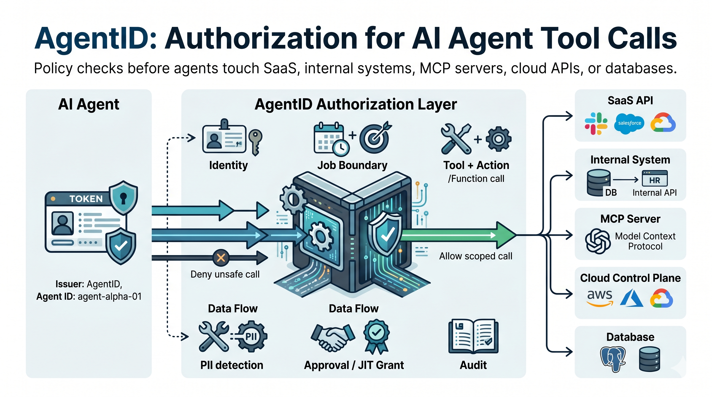
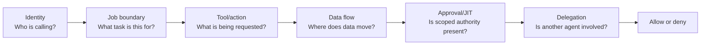
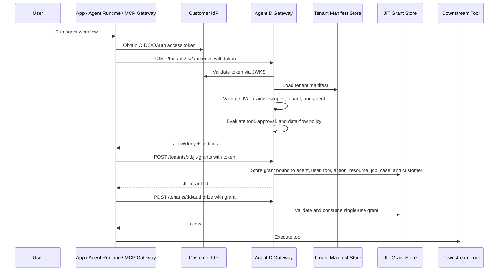

# AgentID

**AgentID** is an open-source authorization layer for AI agent tool calls.

It helps teams declare, validate, and enforce what agents are allowed to do
across SaaS apps, internal systems, cloud control planes, databases,
provider-hosted tools, and MCP gateways.



The core idea is simple:

> Every production agent should have an authority contract that says who it is, who owns it, what it can request, when authority should be issued just in time, where data can flow, when it needs approval, and how it can be stopped.

AgentID does **not** replace IAM, OAuth, MCP gateways, OPA, Cedar, or enterprise security tools. It sits one layer above them as a portable authorization contract for agent identity, delegation, tool access, intent confirmation, just-in-time authorization, data-flow boundaries, approval rules, runtime enforcement expectations, audit behavior, and kill-switch behavior.

For gateway deployments, AgentID is meant to run at an enterprise-controlled
boundary:

```text
Enterprise Agent -> Enterprise Gateway or App Runtime -> AgentID Check -> Internal, SaaS, or MCP Tool
```

---

## Quick Start

```bash
git clone https://github.com/dinpd/AgentID.git
cd AgentID
python -m pip install -e ".[dev]"
agentid validate examples/provider-mcp-support-agent.yaml
agentid risk-score examples/provider-mcp-support-agent.yaml
agentid generate-policy examples/provider-mcp-support-agent.yaml --target opa
```

Try the hosted demo:

- Gateway-control demo: [`agentid-refund-demo.drisw.workers.dev`](https://agentid-refund-demo.drisw.workers.dev/)
- Policy builder: [`agentid-policy-builder.pages.dev`](https://agentid-policy-builder.pages.dev/)

For a full implementation walkthrough, see [`docs/getting-started.md`](docs/getting-started.md).
For SaaS integration patterns, see [`docs/integration-patterns.md`](docs/integration-patterns.md).
For MCP gateway integration, see [`docs/mcp-gateway-integration.md`](docs/mcp-gateway-integration.md).
For job-to-be-done boundaries, see [`docs/job-boundaries.md`](docs/job-boundaries.md).
For scoped agent-to-agent delegation, see [`docs/agent-to-agent-delegation.md`](docs/agent-to-agent-delegation.md).

---

## Why this exists

Most agent projects define tools and credentials in ad hoc config files. As
agents move into production, those tools span internal services, SaaS APIs, MCP
servers, cloud control planes, databases, and provider-hosted capabilities.
AgentID gives teams a local policy checkpoint before those calls execute.

What is often missing is a clear answer to:

- What is this agent?
- Who owns it?
- What systems can it touch?
- What actions can it request?
- Which actions require just-in-time authority?
- Which actions require approval?
- What data is allowed to flow from one system to another?
- Can it call other agents?
- When does its authority expire?
- What should be logged?
- How can it be stopped?

AgentID turns those questions into a small manifest that can be reviewed by developers, security teams, platform teams, and product owners.

AgentID can also describe how callers authenticate to a gateway. The `oidc`
section maps customer identity-provider claims to AgentID concepts such as
tenant, user, and agent, then declares the scopes required to authorize tool
calls, read policies, or issue JIT grants.

---

## Important framing

Identity is necessary, but not sufficient.

A valid agent identity does not imply a valid action. An agent can have the right token and still take the wrong action because the task was ambiguous, the context was poisoned, or a downstream tool interpreted the request differently.

AgentID treats identity as the foundation, runtime authorization as the control plane, and audit as the accountability layer.

The manifest should not be treated as a broad permission grant. It should be treated as an **eligibility contract**: what the agent may request, under what conditions, for how long, and with what approval.

For sensitive actions, actual authority should be issued **just in time** and bound to the agent, user, tool, action, resource, approval, and time window.

---

## Authority model

AgentID models agent authority as a runtime decision, not a static role.



At runtime, a SaaS app, agent runtime, or enterprise gateway asks the AgentID
gateway before tool execution. In MCP deployments, the enterprise MCP gateway
performs this check before forwarding a `tools/call` request to an internal or
provider MCP server. The gateway evaluates:

- **Identity:** the caller token maps to the expected tenant, user, and agent.
- **Job boundary:** the request belongs to an allowed job, case, and customer.
- **Tool/action:** the requested tool and action are declared in the manifest.
- **Data flow:** source and destination are allowed for this agent.
- **Approval/JIT:** sensitive actions have approval and a scoped, valid grant.
- **Delegation:** agent hand-offs stay within allowed targets, depth, approval,
  and delegated tool boundaries.

The result is an eligibility decision. The downstream application or provider
should still perform its normal business authorization checks before executing
the tool.

---

## CLI

```bash
agentid validate examples/provider-mcp-support-agent.yaml
agentid explain examples/provider-mcp-support-agent.yaml
agentid risk-score examples/provider-mcp-support-agent.yaml
agentid generate-policy examples/provider-mcp-support-agent.yaml --target opa
agentid audit examples/sample-tool-log.json --manifest examples/customer-support-refund-agent.yaml
agentid schema > schema/agentid.schema.json
agentid config-ui --output agentid-policy-builder.html
agentid gateway examples/provider-mcp-support-agent.yaml --host 127.0.0.1 --port 8787
```

`config-ui` writes a self-contained browser UI for building an AgentID manifest and starter OPA policy.

The JSON Schema is available at [`schema/agentid.schema.json`](schema/agentid.schema.json)
and can be emitted with `agentid schema`. Add this to a manifest for editor
validation:

```yaml
$schema: https://raw.githubusercontent.com/dinpd/AgentID/main/schema/agentid.schema.json
```

AgentID also ships a GitHub Action for PR checks:

```yaml
name: AgentID
on: [pull_request]
jobs:
  agentid:
    runs-on: ubuntu-latest
    steps:
      - uses: actions/checkout@v4
      - uses: dinpd/AgentID@main
        with:
          manifests: "agents/*.yaml"
          max-risk: "75"
```

For application and gateway runtime integration, see the TypeScript helper in
[`sdk/typescript/`](sdk/typescript/). It provides `authorizeToolCall`,
`requestJitGrant`, and `assertAllowed` wrappers for the gateway API.
For architecture guidance, see
[`docs/integration-patterns.md`](docs/integration-patterns.md).
For MCP server calls, including internal and provider-hosted servers, see
[`docs/mcp-gateway-integration.md`](docs/mcp-gateway-integration.md).
For a reference adapter, see [`mcp-gateway-adapter/`](mcp-gateway-adapter/).

`gateway` starts a lightweight HTTP authorization gateway for agent tool-call
integration. The gateway exposes:

| Endpoint | Purpose |
|---|---|
| `GET /health` | Check gateway health and active agent ID |
| `GET /policy?target=opa` | Return generated policy for the active manifest |
| `POST /authorize` | Authorize a proposed tool call against the manifest |
| `POST /jit-grants` | Issue an in-memory JIT grant for a just-in-time tool |

Set `AGENTID_GATEWAY_API_KEY` or pass `--api-key` to require `Authorization: Bearer <key>`.

For edge deployment, see [`cloudflare/`](cloudflare/) for a Cloudflare Workers
gateway with Durable Object-backed JIT grants and a GitHub Actions deployment
workflow.

## MCP Gateway Adapter

The reference adapter in [`mcp-gateway-adapter/`](mcp-gateway-adapter/) shows
how an enterprise MCP gateway can enforce AgentID before forwarding tool calls:

```text
MCP client -> MCP gateway adapter -> AgentID /authorize -> downstream MCP server
```

It accepts HTTP JSON-RPC requests, filters `tools/list`, intercepts
`tools/call`, maps MCP tool arguments to AgentID fields such as `job_id`,
`case_id`, `customer_id`, `resource`, `data_from`, and `data_to`, then returns
an MCP error on deny or forwards the call on allow.

```bash
cd mcp-gateway-adapter
npm install
npm test
npm run build
```

See [`docs/mcp-gateway-integration.md`](docs/mcp-gateway-integration.md),
[`docs/mcp-gateway-demo.md`](docs/mcp-gateway-demo.md), and
[`examples/provider-mcp-support-agent.yaml`](examples/provider-mcp-support-agent.yaml)
for the enterprise gateway pattern.

---

The hosted gateway-control demo is available at
[`agentid-refund-demo.drisw.workers.dev`](https://agentid-refund-demo.drisw.workers.dev/).
It shows the broader AgentID model in two concrete flows: a SaaS support app
consulting AgentID before refund actions, and an MCP gateway checking provider
CRM tool calls before forwarding them. The MCP flow filters provider tools,
allows a declared CRM read, denies a CRM write without JIT, and then allows the
write after a scoped grant. The demo Worker mints a short-lived OIDC-style JWT
server-side, and the gateway validates its claims against the tenant manifest.
Demo source lives in [`demo/`](demo/).




The hosted demo uses a Worker-minted demo JWT so it can run without an
external identity provider. Production deployments should validate access
tokens from the customer's OIDC provider via JWKS.

---

## Manifest concepts

| Concept | Meaning |
|---|---|
| `agent` | Unique identity, owner, purpose, environment, and expiry |
| `delegation` | Who or what the agent is allowed to act on behalf of |
| `delegation_chain` | Whether the agent can call other agents, and which scoped tools may be delegated |
| `intent` | Actions that require explicit human confirmation |
| `job_boundary` | Job-to-be-done, case, and customer boundaries for runtime authorization |
| `oidc` | Issuer, audience, claim mapping, and scopes for gateway access |
| `jit_authorization` | Rules for issuing temporary, scoped authority at runtime |
| `tools` | External capabilities the agent may use |
| `auth_mode` | Whether access is `delegated`, `service`, or `just_in_time` |
| `approval` | Whether an action requires approval: `none`, `notify`, `human_confirm`, `step_up`, `manager`, or `block` |
| `constraints` | Limits such as max amount, allowed reasons, token TTL, domains, or resource patterns |
| `data_flows` | Allowed or blocked source-to-destination flows |
| `risk_tiers` | Default approval rules by risk category |
| `runtime` | Runtime enforcement and drift-detection expectations |
| `mcp_gateway` | Mapping rules for MCP tools and argument-derived context |
| `audit` | What must be logged and retained |
| `kill_switch` | Whether policy violations should revoke or suspend authority |

---

## Design principles

1. **Agents are first-class identities.**
2. **Authority should be explicit.**
3. **Delegation matters.**
4. **Eligibility is not the same as granted authority.**
5. **Sensitive authority should be issued just in time.**
6. **Intent confirmation is different from delegated access.**
7. **Data-flow boundaries matter as much as tool permissions.**
8. **Approval should be action-level and risk-tiered.**
9. **Auditability is part of identity.**
10. **Revocation must be practical.**

---

## Roadmap

Implemented:

- JSON Schema for manifests
- GitHub Action for PR validation and risk-threshold checks
- Web-based manifest builder
- Python authorization gateway
- Cloudflare Workers gateway with KV tenant manifests and Durable Object JIT grants
- OIDC claim/scopes section in manifests
- Scoped agent-to-agent delegation checks
- Job-to-be-done boundary checks
- Demo OIDC JWT flow and production JWKS validation path
- TypeScript gateway client helper
- Reference MCP gateway adapter for `tools/list` and `tools/call`
- MCP gateway adapter demo with mock provider server
- MCP gateway integration guide and enterprise/provider MCP example manifest
- Hosted gateway-control demo with SaaS and MCP flows
- CI checks for tests, schema validation, manifest risk, and TypeScript SDK

Next:

- More ecommerce manifests and audit-log examples
- MCP tool metadata import/export and tool drift detection for `tools/list`
  changes, schema changes, and newly exposed write/admin tools
- Stronger policy backend support, including OPA improvements, Cedar policy
  generation, and CEL examples for gateway-side authorization
- Durable delegation-grant endpoint with source/target manifest intersection
- OAuth scope recommendation from tool manifests
- Risk policy profiles by environment
- Audit log normalization and a versioned decision-event spec for agent ID,
  user ID, tool, action, resource, job boundary, decision, findings, and JIT
  grant metadata
- Richer JIT approval flow with approval request objects, revocation, webhook
  callbacks, and approval audit trail
- Additional SDK and middleware helpers for Python, MCP gateways, HTTP apps, and
  Cloudflare Workers
- Delegation-chain visualization
- Real-use-case examples for support refunds, CRM updates, GitHub automation,
  deploys, secret access, database writes, email sends, and incident response

---

## License

MIT
