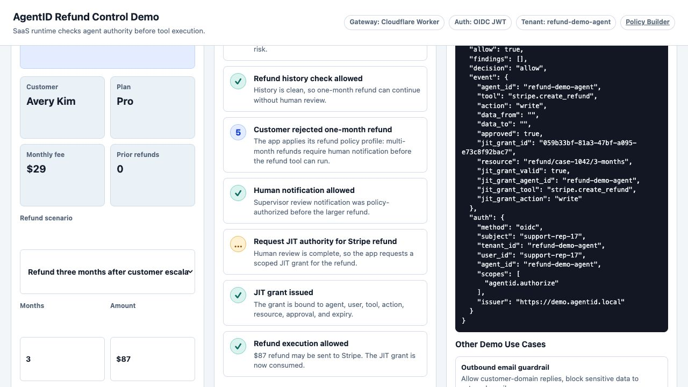
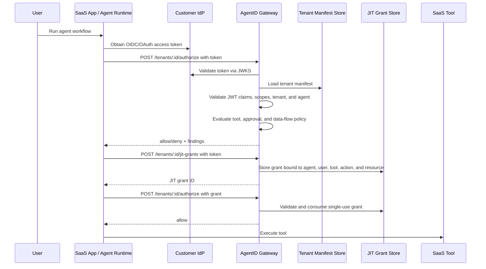

# AgentID

**AgentID** is a lightweight open-source toolkit for declaring, validating, reviewing, and auditing AI agent authority.


The core idea is simple:

> Every production agent should have an authority contract that says who it is, who owns it, what it can request, when authority should be issued just in time, where data can flow, when it needs approval, and how it can be stopped.

AgentID does **not** replace IAM, OAuth, MCP gateways, OPA, Cedar, or enterprise security tools. It sits one layer above them as a portable declaration format for agent identity, delegation, tool access, intent confirmation, just-in-time authorization, data-flow boundaries, approval rules, runtime enforcement expectations, audit behavior, and kill-switch behavior.

---

## Quick Start

```bash
git clone https://github.com/dinpd/AgentID.git
cd AgentID
python -m pip install -e ".[dev]"
agentid validate examples/customer-support-refund-agent.yaml
agentid risk-score examples/customer-support-refund-agent.yaml
agentid generate-policy examples/customer-support-refund-agent.yaml --target opa
```

Try the hosted demo:

- Refund-control demo: [`agentid-refund-demo.drisw.workers.dev`](https://agentid-refund-demo.drisw.workers.dev/)
- Policy builder: [`agentid-policy-builder.pages.dev`](https://agentid-policy-builder.pages.dev/)

For a full implementation walkthrough, see [`docs/getting-started.md`](docs/getting-started.md).
For SaaS integration patterns, see [`docs/integration-patterns.md`](docs/integration-patterns.md).
For scoped agent-to-agent delegation, see [`docs/agent-to-agent-delegation.md`](docs/agent-to-agent-delegation.md).

---

## Why this exists

Most agent projects define tools and credentials in ad hoc config files.

What is often missing is a clear answer to:

- What is this agent?
- Who owns it?
- What systems can it touch?
- What actions can it request?
- Which actions require just-in-time authority?
- Which actions require approval?
- What data is allowed to flow from one system to another?
- Can it call other agents?
- When does its authority expire?
- What should be logged?
- How can it be stopped?

AgentID turns those questions into a small manifest that can be reviewed by developers, security teams, platform teams, and product owners.

AgentID can also describe how callers authenticate to a gateway. The `oidc`
section maps customer identity-provider claims to AgentID concepts such as
tenant, user, and agent, then declares the scopes required to authorize tool
calls, read policies, or issue JIT grants.

---

## Important framing

Identity is necessary, but not sufficient.

A valid agent identity does not imply a valid action. An agent can have the right token and still take the wrong action because the task was ambiguous, the context was poisoned, or a downstream tool interpreted the request differently.

AgentID treats identity as the foundation, runtime authorization as the control plane, and audit as the accountability layer.

The manifest should not be treated as a broad permission grant. It should be treated as an **eligibility contract**: what the agent may request, under what conditions, for how long, and with what approval.

For sensitive actions, actual authority should be issued **just in time** and bound to the agent, user, tool, action, resource, approval, and time window.

---

## CLI

```bash
agentid validate examples/customer-support-refund-agent.yaml
agentid explain examples/customer-support-refund-agent.yaml
agentid risk-score examples/customer-support-refund-agent.yaml
agentid generate-policy examples/customer-support-refund-agent.yaml --target opa
agentid audit examples/sample-tool-log.json --manifest examples/customer-support-refund-agent.yaml
agentid schema > schema/agentid.schema.json
agentid config-ui --output agentid-policy-builder.html
agentid gateway examples/customer-support-refund-agent.yaml --host 127.0.0.1 --port 8787
```

`config-ui` writes a self-contained browser UI for building an AgentID manifest and starter OPA policy.

The JSON Schema is available at [`schema/agentid.schema.json`](schema/agentid.schema.json)
and can be emitted with `agentid schema`. Add this to a manifest for editor
validation:

```yaml
$schema: https://raw.githubusercontent.com/dinpd/AgentID/main/schema/agentid.schema.json
```

AgentID also ships a GitHub Action for PR checks:

```yaml
name: AgentID
on: [pull_request]
jobs:
  agentid:
    runs-on: ubuntu-latest
    steps:
      - uses: actions/checkout@v4
      - uses: dinpd/AgentID@main
        with:
          manifests: "agents/*.yaml"
          max-risk: "75"
```

For SaaS runtime integration, see the TypeScript helper in
[`sdk/typescript/`](sdk/typescript/). It provides `authorizeToolCall`,
`requestJitGrant`, and `assertAllowed` wrappers for the gateway API.
For architecture guidance, see
[`docs/integration-patterns.md`](docs/integration-patterns.md).

`gateway` starts a lightweight HTTP authorization gateway for SaaS integration. The gateway exposes:

| Endpoint | Purpose |
|---|---|
| `GET /health` | Check gateway health and active agent ID |
| `GET /policy?target=opa` | Return generated policy for the active manifest |
| `POST /authorize` | Authorize a proposed tool call against the manifest |
| `POST /jit-grants` | Issue an in-memory JIT grant for a just-in-time tool |

Set `AGENTID_GATEWAY_API_KEY` or pass `--api-key` to require `Authorization: Bearer <key>`.

For edge deployment, see [`cloudflare/`](cloudflare/) for a Cloudflare Workers
gateway with Durable Object-backed JIT grants and a GitHub Actions deployment
workflow.

The hosted refund-control demo is available at
[`agentid-refund-demo.drisw.workers.dev`](https://agentid-refund-demo.drisw.workers.dev/).
It shows a SaaS support app consulting AgentID before refund actions, including
customer refund-history checks, human notification for escalations, and JIT
authority before Stripe refund execution. The demo Worker mints a short-lived
OIDC-style JWT server-side, and the gateway validates its claims against the
tenant manifest. Demo source lives in [`demo/`](demo/).





The hosted demo uses a Worker-minted demo JWT so it can run without an
external identity provider. Production deployments should validate access
tokens from the customer's OIDC provider via JWKS.

---

## Manifest concepts

| Concept | Meaning |
|---|---|
| `agent` | Unique identity, owner, purpose, environment, and expiry |
| `delegation` | Who or what the agent is allowed to act on behalf of |
| `delegation_chain` | Whether the agent can call other agents, and which scoped tools may be delegated |
| `intent` | Actions that require explicit human confirmation |
| `oidc` | Issuer, audience, claim mapping, and scopes for gateway access |
| `jit_authorization` | Rules for issuing temporary, scoped authority at runtime |
| `tools` | External capabilities the agent may use |
| `auth_mode` | Whether access is `delegated`, `service`, or `just_in_time` |
| `approval` | Whether an action requires approval: `none`, `notify`, `human_confirm`, `step_up`, `manager`, or `block` |
| `constraints` | Limits such as max amount, allowed reasons, token TTL, domains, or resource patterns |
| `data_flows` | Allowed or blocked source-to-destination flows |
| `risk_tiers` | Default approval rules by risk category |
| `runtime` | Runtime enforcement and drift-detection expectations |
| `audit` | What must be logged and retained |
| `kill_switch` | Whether policy violations should revoke or suspend authority |

---

## Design principles

1. **Agents are first-class identities.**
2. **Authority should be explicit.**
3. **Delegation matters.**
4. **Eligibility is not the same as granted authority.**
5. **Sensitive authority should be issued just in time.**
6. **Intent confirmation is different from delegated access.**
7. **Data-flow boundaries matter as much as tool permissions.**
8. **Approval should be action-level and risk-tiered.**
9. **Auditability is part of identity.**
10. **Revocation must be practical.**

---

## Roadmap

Implemented:

- JSON Schema for manifests
- GitHub Action for PR validation and risk-threshold checks
- Web-based manifest builder
- Python authorization gateway
- Cloudflare Workers gateway with KV tenant manifests and Durable Object JIT grants
- OIDC claim/scopes section in manifests
- Scoped agent-to-agent delegation checks
- Demo OIDC JWT flow and production JWKS validation path
- TypeScript gateway client helper
- Hosted refund-control demo
- CI checks for tests, schema validation, manifest risk, and TypeScript SDK

Next:

- More ecommerce manifests and audit-log examples
- Stronger OPA policy generation and Cedar policy generation
- Durable delegation-grant endpoint with source/target manifest intersection
- MCP tool metadata import/export
- OAuth scope recommendation from tool manifests
- Risk policy profiles by environment
- Audit log normalization and versioned event spec
- Delegation-chain visualization
- DevOps examples for deploys, secret access, database writes, and incident response

---

## License

MIT
