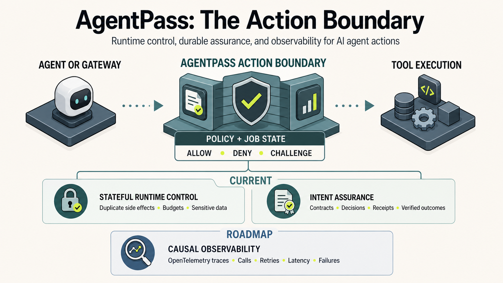

# AgentPass

**Action authorization and execution assurance for AI agents.**

AgentPass is an action-control and evidence layer that sits outside the agent
loop. It decides whether a specific tool call may execute and preserves durable
records of what was proposed, authorized, executed, observed, and assessed.

> AgentPass controls consequential AI agent actions and produces independently
> verifiable evidence of what was authorized and executed.

```text
Agent proposes tool call -> AgentPass checks policy + state -> allow / deny / challenge
```

Identity, workload, and policy systems provide inputs to that decision.
AgentPass composes them at the action boundary and adds stateful enforcement,
provider-verifiable authorization evidence, and execution assurance. Its open
conformance work demonstrates interoperability; it is not the product category.
See [Project Positioning](docs/positioning.md).

## Try AgentPass

| Experience | What it demonstrates |
| --- | --- |
| [Gateway and refund control](https://agentid-refund-demo.drisw.workers.dev/) | Approval, scoped JIT authority, idempotency, audit, and provider-tool authorization in a support workflow. |
| [DevOps and SRE control](https://agentid-devops-demo.drisw.workers.dev/) | Production-context checks, deployment approval, JIT grants, dry-run dispatch, canary monitoring, and rollback control. |
| [Policy builder](https://agentid-policy-builder.pages.dev/) | Browser-based manifest authoring with generated YAML, starter OPA policy, and example gateway requests. |

Prefer to start locally? Install the guard package and run the quickstart below.
The hosted observability console is an operator surface protected by Cloudflare
Access, not a public demo.

## Quick Start

Install the local TypeScript guard:

```bash
npm install @dinpd/ai-agent-guard
```

Wrap a consequential tool call:

```ts
import { createToolGate } from "@dinpd/ai-agent-guard";

const gate = createToolGate({ policy });

const execution = await gate.run(
  {
    agentId: "support-agent",
    jobId: "case-1042",
    tool: "stripe.refund",
    action: "pay",
    resource: "payment/pi_123",
    amountUsd: 49,
    idempotencyKey: "refund-case-1042-pi_123"
  },
  () => stripe.refunds.create({ payment_intent: "pi_123", amount: 4900 })
);

if (!execution.executed) {
  return execution.decision;
}
```

Run the repository demos:

```bash
git clone https://github.com/dinpd/AgentPass.git
cd AgentPass/packages/guard
npm install
npm run demo:quickstart
npm run demo:mcp
npm run demo:circuit
npm run demo:gate
npm run demo:pii
npm test
```

The guard package is published as
[`@dinpd/ai-agent-guard`](https://www.npmjs.com/package/@dinpd/ai-agent-guard).
See [`packages/guard/`](packages/guard/) for starter policies and more examples.

## How It Works

RBAC can say which identity may access a tool. OAuth can prove access to a
server. MCP tool schemas describe inputs. Agent frameworks can decide which
tools are visible to a model. AgentPass answers the runtime question:

> Should this specific tool call, with this payload, in this job state, execute right now?

The gate runs outside model context and agent-editable memory. It keeps the
state needed to stop failures that static access control and prompt rules miss:

- Duplicate refunds, payments, emails, exports, deployments, or writes.
- Runaway loops and repeated tool calls.
- Token, cost, runtime, and tool-call budget spikes.
- PII or sensitive data moving to the wrong destination.
- Risky actions without action-scoped approval.
- Replays or payload changes after authority was granted.

Approvals bind to the proposed tool, resource, payload, amount, destination,
job, and expiry. Side-effectful actions bind an idempotency key or call
fingerprint to the recorded provider result. The gate therefore remembers what
actually executed rather than relying on what the agent thinks happened.

AgentPass separates three concepts that agent systems often blur:

```text
Skill = workflow package
Tool = executable operation
Flow = data movement boundary
```

The local guard applies tool and flow checks in-process. Larger deployments use
the same model through manifests, approvals, hosted gateways, signed receipts,
provider-side verification, and durable evidence.



At enterprise scale, every consequential action crosses an enterprise-controlled
gateway before reaching internal, SaaS, cloud, or provider-hosted tools.
AgentPass acts as the decision service; the gateway remains the policy
enforcement point, and providers can independently verify scoped authorization
receipts.

AgentPass also fits into broader task-scoped security architectures such as
Cloudflare's [Agent Access Model (AAM)](https://blog.cloudflare.com/the-agent-access-model/).
It implements the action-control and evidence layers while
integrating with external identity brokers and network enforcement rather than
replacing them.

## Choose Your Path

| You are building | Start here |
| --- | --- |
| An agent or application | [`packages/guard/`](packages/guard/) and the [local examples](packages/guard/examples/) |
| An enterprise AI platform | [Enterprise governance](docs/enterprise-governance.md) and [authorization in practice](docs/authorization-in-practice.md) |
| An MCP gateway or interceptor | [`mcp-gateway-adapter/`](mcp-gateway-adapter/) and [MCP gateway integration](docs/mcp-gateway-integration.md) |
| A SaaS, API, or MCP provider | [Provider MCP authorization](docs/provider-mcp-authorization.md), [Express middleware](packages/provider-express/), or [FastAPI helpers](packages/provider-fastapi/) |
| A security or risk program | [Enterprise topology](docs/enterprise-agent-action-control-topology.png), [receipt profiles](docs/receipt-profiles.md), and [standards alignment](docs/standards-alignment.md) |
| An observability or assurance implementation | [Intent assurance](docs/intent-assurance.md), the [operator console](console/), and [community proposals](docs/proposals/) |

For the enterprise CLI and manifest workflow:

```bash
git clone https://github.com/dinpd/AgentPass.git
cd AgentPass
python -m pip install -e ".[dev]"
agentpass validate examples/provider-mcp-support-agent.yaml
agentpass risk-score examples/provider-mcp-support-agent.yaml
agentpass generate-policy examples/provider-mcp-support-agent.yaml --target opa
```

`agentpass` is the primary CLI. `agentid` remains as a compatibility alias, and
some package, schema, environment-variable, and receipt identifiers retain the
earlier name.

## Product Layers

AgentPass develops as three connected product layers:

1. **Runtime authorization and control:** policy enforcement, approvals,
   budgets, data-flow controls, idempotency, replay protection, and integration
   at agent, workflow, gateway, and provider boundaries.
2. **Portable provider trust and interoperability:** signed action-bound
   evidence, independent provider verification, contract drift detection,
   conformance cases, profiles, and multi-implementation demonstrations.
3. **Execution and outcome assurance:** linked execution receipts, immutable
   evidence, verified observations, causal traces, intent evaluation, and
   comparable assurance metrics.

Framework wrappers and conformance suites are delivery mechanisms within these
layers, not separate product categories.

## Current Capabilities

- Local TypeScript tool gate with circuit breakers, budgets, approvals,
  idempotency, PII/data-flow controls, and decision audit events.
- MCP `tools/call` interception and an MCP gateway adapter.
- Cloudflare gateway runtime with tenant manifests, OIDC checks, approval
  queues, scoped JIT grants, audit timelines, and provider-result replay.
- Provider authorization receipts signed as JWS with a public JWKS endpoint.
- Express and FastAPI provider-side verification middleware.
- Versioned intent contracts, execution evidence, verified outcome
  observations, immutable snapshots, final evaluations, and quality rollups.
- Access-protected operator console for fleet-level outcome, constraint,
  confidence, execution-discipline, and data-quality review.
- DevOps/SRE and OpenClaw solution packs for concrete integration paths.

See [Current implementation status](docs/action-gate-roadmap.md) for planned and
adopter-facing work.

## Architecture And Documentation

- [Enterprise deployment and governance](docs/enterprise-governance.md)
- [Enterprise-managed MCP authorization sequence](docs/enterprise-managed-auth-runtime-authorization.svg)
- [Action-gate roadmap](docs/action-gate-roadmap.md)
- [Intent assurance](docs/intent-assurance.md)
- [Decision-basis evidence](docs/decision-basis.md)
- [Provider contracts and authorization](docs/provider-mcp-authorization.md)
- [Agentic identity standards crosswalk](docs/agentic-identity-standards-crosswalk.md)
- [Interoperability positioning](docs/interoperability-positioning.md)
- [Explainer video](https://github.com/user-attachments/assets/4d5757f7-ffa0-4c0f-a5bc-1bde4336703a)

## Community Specifications And Roadmap

AgentPass publishes experimental, vendor-neutral drafts for
[Agent Action Boundary Evidence](docs/proposals/agent-action-boundary-evidence-v0.1.md)
and [Agent Outcome Observability and Assurance Metrics](docs/proposals/agent-outcome-observability-assurance-metrics-v0.1.md).
They are discussion documents, not adopted standards; AgentPass is a
non-normative reference implementation.

Implementation work and identified gaps are tracked in the public
[Intent Observability & Assurance project](https://github.com/users/dinpd/projects/2).
The [Action Gate Roadmap](docs/action-gate-roadmap.md) tracks product layers and
adopter-facing demonstrations.

## Open Source Governance

- [Contributing](CONTRIBUTING.md)
- [Governance](GOVERNANCE.md)
- [Security policy](SECURITY.md)
- [Code of Conduct](CODE_OF_CONDUCT.md)
- [Support](SUPPORT.md)
- [Maintainers](MAINTAINERS.md)

## License

Apache-2.0
