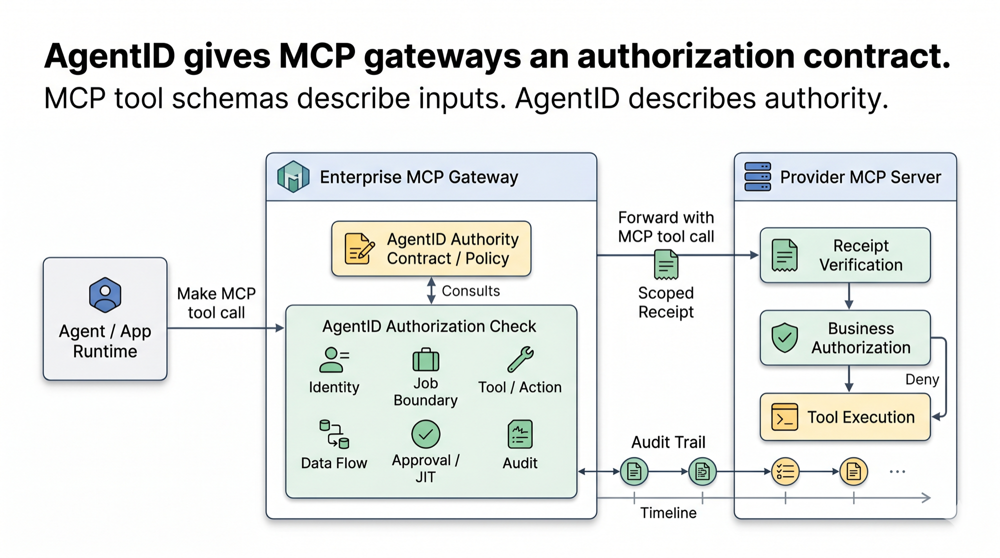
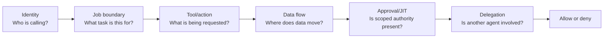
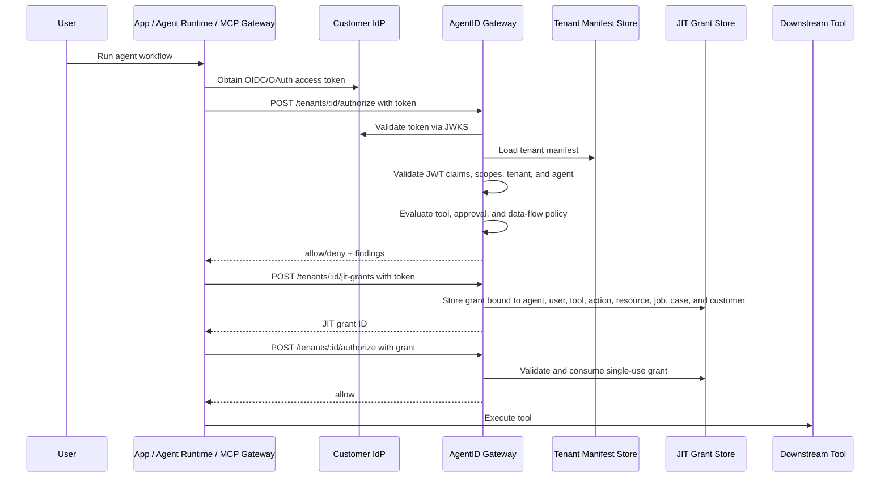

# AgentID

**Authorization contracts for AI agent tool execution.**

AgentID helps API providers, MCP gateway builders, and enterprise AI platform
teams answer one runtime question:

> Should this agent perform this tool action on this resource, for this user, job, customer, approval, and time window?

OAuth can prove access to a server. MCP tool schemas describe inputs. AgentID
defines the missing authorization contract for agent tool calls across SaaS
apps, internal systems, cloud control planes, databases, provider-hosted tools,
and MCP gateways.



The core idea is simple:

> Every production agent should have an authority contract that says who it is, who owns it, what it can request, when authority should be issued just in time, where data can flow, when it needs approval, and how it can be stopped.

AgentID does **not** replace IAM, OAuth, MCP gateways, OPA, Cedar, or enterprise security tools. It sits one layer above them as a portable authorization contract for agent identity, delegation, tool access, intent confirmation, just-in-time authorization, data-flow boundaries, approval rules, runtime enforcement expectations, audit behavior, and kill-switch behavior.

## Who AgentID is for

- **API and SaaS providers** turning APIs into MCP tools without giving agents
  broad authority.
- **Enterprise AI platform teams** reviewing which tools agents may use, under
  what conditions.
- **MCP gateway builders** enforcing policy before forwarding `tools/call`.
- **Security teams** needing audit evidence for agent actions, approvals, JIT
  grants, and tool execution.

For gateway deployments, AgentID is meant to run at an enterprise-controlled
boundary:

```text
Enterprise Agent -> Enterprise Gateway or App Runtime -> AgentID Check -> Internal, SaaS, or MCP Tool
```

For providers turning APIs into MCP servers, AgentID also defines an
auth-first pattern: publish a provider MCP authorization contract, let
enterprises review and overlay local agent policy, require scoped receipts for
high-blast-radius actions, and keep provider business authorization in the
execution path. See [Two-sided MCP authorization](#two-sided-mcp-authorization)
and [`docs/turn-your-api-into-mcp-safely.md`](docs/turn-your-api-into-mcp-safely.md).

If you are here for MCP provider authorization:

- Article: [`Turn Your API Into MCP, Safely`](docs/turn-your-api-into-mcp-safely.md)
- Local demo: [`docs/provider-mcp-demo.md`](docs/provider-mcp-demo.md)
- Provider contract schema: [`schema/provider-mcp-contract.schema.json`](schema/provider-mcp-contract.schema.json)
- Example contract: [`examples/provider-mcp-contract.yaml`](examples/provider-mcp-contract.yaml)

---

## Quick Start

```bash
git clone https://github.com/dinpd/AgentID.git
cd AgentID
python -m pip install -e ".[dev]"
agentid validate examples/provider-mcp-support-agent.yaml
agentid risk-score examples/provider-mcp-support-agent.yaml
agentid generate-policy examples/provider-mcp-support-agent.yaml --target opa
```

Try the hosted demo:

- Gateway-control demo: [`agentid-refund-demo.drisw.workers.dev`](https://agentid-refund-demo.drisw.workers.dev/)
- Policy builder: [`agentid-policy-builder.pages.dev`](https://agentid-policy-builder.pages.dev/)

For a full implementation walkthrough, see [`docs/getting-started.md`](docs/getting-started.md).
For ecosystem positioning and business requirements, see [`docs/ecosystem-positioning.md`](docs/ecosystem-positioning.md).
For SaaS integration patterns, see [`docs/integration-patterns.md`](docs/integration-patterns.md).
For MCP gateway integration, see [`docs/mcp-gateway-integration.md`](docs/mcp-gateway-integration.md).
For provider-side MCP authorization, see [`docs/provider-mcp-authorization.md`](docs/provider-mcp-authorization.md).
For provider MCP contract CI checks, see [`docs/provider-mcp-ci.md`](docs/provider-mcp-ci.md).
For provider MCP positioning and adoption ideas, see [`docs/provider-mcp-positioning.md`](docs/provider-mcp-positioning.md).
For the API-to-MCP article, see [`docs/turn-your-api-into-mcp-safely.md`](docs/turn-your-api-into-mcp-safely.md).
For the provider MCP authorization demo, see [`docs/provider-mcp-demo.md`](docs/provider-mcp-demo.md).
For job-to-be-done boundaries, see [`docs/job-boundaries.md`](docs/job-boundaries.md).
For scoped agent-to-agent delegation, see [`docs/agent-to-agent-delegation.md`](docs/agent-to-agent-delegation.md).

---

## Why this exists

Most agent projects define tools and credentials in ad hoc config files. As
agents move into production, those tools span internal services, SaaS APIs, MCP
servers, cloud control planes, databases, and provider-hosted capabilities.
AgentID gives teams a local policy checkpoint before those calls execute.

What is often missing is a clear answer to:

- What is this agent?
- Who owns it?
- What systems can it touch?
- What actions can it request?
- Which actions require just-in-time authority?
- Which actions require approval?
- What data is allowed to flow from one system to another?
- Can it call other agents?
- When does its authority expire?
- What should be logged?
- How can it be stopped?

AgentID turns those questions into a small manifest that can be reviewed by developers, security teams, platform teams, and product owners.

AgentID can also describe how callers authenticate to a gateway. The `oidc`
section maps customer identity-provider claims to AgentID concepts such as
tenant, user, and agent, then declares the scopes required to authorize tool
calls, read policies, or issue JIT grants.

## Positioning in one minute

AgentID sits between agent identity and tool execution.

It does not replace OAuth, IAM, OPA, Cedar, OpenFGA, MCP authorization, or
provider business rules. It gives those systems a shared contract for agent
authority:

- what tool is being called
- what action is requested
- what resource is affected
- what job, case, customer, and user are in scope
- whether approval or JIT authority is required
- what data flow is allowed
- what audit evidence should exist

---

## Important framing

Identity is necessary, but not sufficient.

A valid agent identity does not imply a valid action. An agent can have the right token and still take the wrong action because the task was ambiguous, the context was poisoned, or a downstream tool interpreted the request differently.

AgentID treats identity as the foundation, runtime authorization as the control plane, and audit as the accountability layer.

The manifest should not be treated as a broad permission grant. It should be treated as an **eligibility contract**: what the agent may request, under what conditions, for how long, and with what approval.

For sensitive actions, actual authority should be issued **just in time** and bound to the agent, user, tool, action, resource, approval, and time window.

---

## Authority model

AgentID models agent authority as a runtime decision, not a static role.



At runtime, a SaaS app, agent runtime, or enterprise gateway asks an AgentID
decision endpoint before tool execution. In MCP deployments, the enterprise MCP gateway
performs this check before forwarding a `tools/call` request to an internal or
provider MCP server. The gateway evaluates:

- **Identity:** the caller token maps to the expected tenant, user, and agent.
- **Job boundary:** the request belongs to an allowed job, case, and customer.
- **Tool/action:** the requested tool and action are declared in the manifest.
- **Data flow:** source and destination are allowed for this agent.
- **Approval/JIT:** sensitive actions have approval and a scoped, valid grant.
- **Delegation:** agent hand-offs stay within allowed targets, depth, approval,
  and delegated tool boundaries.

The result is an eligibility decision. The downstream application or provider
should still perform its normal business authorization checks before executing
the tool.

---

## Two-sided MCP authorization

For provider-hosted MCP tools, AgentID supports a two-sided authorization
pattern:

```text
Enterprise Agent
  -> Enterprise MCP Gateway
  -> AgentID enterprise authorization
  -> Provider MCP Server
  -> Provider receipt verification
  -> Provider business authorization
  -> Tool execution
```

The enterprise gateway decides whether its agent may attempt a provider tool
call for the current job, case, customer, data flow, approval, and JIT grant.
The provider MCP server then verifies that the forwarded call carries a scoped
authorization receipt before applying its own tenant isolation, delegated-user
authorization, product rules, and audit controls.

For provider-hosted tools, the base authorization contract should start with the
provider. The provider is the source of truth for tool semantics, protected
resource mappings, required context, blast radius, and receipt requirements. The
enterprise imports or reviews that contract, then overlays local agent, user,
job, approval, JIT, and data-flow policy.

Provider-side receipt verification is useful as an audit and interoperability
layer for many tools, and should be treated as an execution precondition for
tools with meaningful blast radius: durable writes, financial actions, external
sends, identity or permission changes, bulk export, deletion, code execution,
or regulated data access.

Providers should publish authorization requirements alongside their MCP tool
schemas so enterprise gateways know which context fields are required, which
tool arguments map to protected resources, and which fields must be bound into
the forwarded authorization receipt.

This fills a gap between existing standards: MCP OAuth secures access to the MCP
server, MCP tool schemas describe execution inputs, MCP annotations provide
behavioral hints, and OAuth Rich Authorization Requests can carry structured
authorization details. None of those currently define a provider-originated
per-tool contract for resource binding, JIT approval, receipt verification,
blast-radius classification, and shared execution audit.

A grounded example is a provider-hosted CRM and billing MCP server for customer
support agents:

- `provider.crm.search_customer` can be allowed as a scoped read.
- `provider.crm.update_customer` should require approval and JIT authority.
- `provider.billing.issue_credit` should require stronger approval, amount
  limits, and provider-side business checks.

This keeps the enterprise and provider responsibilities separate: AgentID
proves the enterprise authorized the agent-originated request, while the
provider still decides whether the underlying business operation may execute.
See [`docs/provider-mcp-authorization.md`](docs/provider-mcp-authorization.md)
for the receipt contract and execution plan, and
[`docs/provider-mcp-positioning.md`](docs/provider-mcp-positioning.md) for the
adoption narrative around auth-first MCP provider tools.

---

## CLI

```bash
agentid validate examples/provider-mcp-support-agent.yaml
agentid explain examples/provider-mcp-support-agent.yaml
agentid risk-score examples/provider-mcp-support-agent.yaml
agentid generate-policy examples/provider-mcp-support-agent.yaml --target opa
agentid audit examples/sample-tool-log.json --manifest examples/customer-support-refund-agent.yaml
agentid mcp analyze examples/mcp-tools-list-risky.json
agentid mcp analyze examples/mcp-tools-list-risky.json --json
agentid mcp fetch https://mcp.example.com/mcp --output tools-list.json
agentid mcp check tools-list.json --max-risk high
agentid mcp diff old-tools-list.json new-tools-list.json
agentid mcp ui --output agentid-mcp-analyzer.html
agentid mcp serve-ui --host 127.0.0.1 --port 8799
agentid provider schema > schema/provider-mcp-contract.schema.json
agentid provider validate examples/provider-mcp-contract.yaml
agentid provider diff old-provider-contract.yaml new-provider-contract.yaml
agentid provider import examples/provider-mcp-contract.yaml --agent enterprise-support-agent --output generated-agent.yaml
agentid provider from-openapi examples/provider-openapi.yaml --provider example-crm --output provider-mcp-contract.yaml
agentid provider verify-receipt examples/provider-signed-receipt.json --secret dev-provider-receipt-secret --require-signed
agentid schema > schema/agentid.schema.json
agentid config-ui --output agentid-policy-builder.html
agentid gateway examples/provider-mcp-support-agent.yaml --host 127.0.0.1 --port 8787
```

`config-ui` writes a self-contained browser UI for building an AgentID manifest and starter OPA policy.

`mcp fetch` connects to an HTTP MCP server, performs the MCP initialize flow,
calls `tools/list`, and writes the JSON response for analysis. `mcp analyze`
scores a saved MCP `tools/list` response for tool capability risk, sensitive
arguments, likely blast radius, and remediation steps. `mcp check` is a
CI-friendly risk gate that exits nonzero when risk exceeds a configured
threshold or drift is detected. `mcp diff` compares two saved `tools/list`
responses to detect newly exposed tools, schema changes, and increased tool
risk. `mcp ui` writes a self-contained browser analyzer with paste/upload
analysis, compare mode, Markdown reports, JSON export, and starter manifest
exports. `mcp serve-ui` serves the same analyzer on localhost with a local-only
fetch endpoint, so the UI can ask the AgentID CLI process to fetch a remote MCP
server without sending credentials to a hosted page.

`provider validate` checks provider-published MCP authorization contracts for
the fields needed to safely expose high-blast-radius tools: action and risk
classification, protected-resource mapping, required authorization context,
receipt binding fields, JIT and approval expectations, receipt TTL, and
single-use requirements. `provider diff` compares two provider contracts for
added, removed, and changed tools, including risk increases, changed protected
resources, changed receipt bindings, changed TTLs, and input-schema drift.
`provider import` turns a provider contract into a reviewable AgentID manifest
starter that enterprises can tighten with local agent, job, approval, OIDC, and
data-flow policy. `provider from-openapi` creates a provider MCP authorization
contract starter from an OpenAPI document, inferring operation names, resource
templates, input schemas, and conservative risk/JIT/receipt requirements for
write, delete, admin, and financial-looking operations. `provider schema`
prints the provider contract JSON Schema for editor and CI validation.
`provider verify-receipt` lets a provider implementation, CI test, or local
demo verify a raw or signed authorization receipt against expected tenant,
agent, tool, action, resource, job, case, customer, approval, JIT grant, and
amount bindings.

The JSON Schema is available at [`schema/agentid.schema.json`](schema/agentid.schema.json)
and can be emitted with `agentid schema`. Add this to a manifest for editor
validation:

```yaml
$schema: https://raw.githubusercontent.com/dinpd/AgentID/main/schema/agentid.schema.json
```

The provider MCP contract JSON Schema is available at
[`schema/provider-mcp-contract.schema.json`](schema/provider-mcp-contract.schema.json)
and can be emitted with `agentid provider schema`. Add this to a provider
contract for editor validation:

```yaml
$schema: https://raw.githubusercontent.com/dinpd/AgentID/main/schema/provider-mcp-contract.schema.json
```

AgentID also ships a GitHub Action for PR checks:

```yaml
name: AgentID
on: [pull_request]
jobs:
  agentid:
    runs-on: ubuntu-latest
    steps:
      - uses: actions/checkout@v4
      - uses: dinpd/AgentID@main
        with:
          manifests: "agents/*.yaml"
          max-risk: "75"
```

For application and gateway runtime integration, see the TypeScript helper in
[`sdk/typescript/`](sdk/typescript/). It provides `authorizeToolCall`,
`requestJitGrant`, and `assertAllowed` wrappers for the gateway API.
For architecture guidance, see
[`docs/integration-patterns.md`](docs/integration-patterns.md).
For MCP server calls, including internal and provider-hosted servers, see
[`docs/mcp-gateway-integration.md`](docs/mcp-gateway-integration.md).
For the provider side of that boundary, including authorization receipts and
provider execution receipts, see
[`docs/provider-mcp-authorization.md`](docs/provider-mcp-authorization.md).
For a reference adapter, see [`mcp-gateway-adapter/`](mcp-gateway-adapter/).
For provider-side Express receipt verification middleware, see
[`packages/provider-express/`](packages/provider-express/).
For provider-side FastAPI receipt verification helpers, see
[`packages/provider-fastapi/`](packages/provider-fastapi/).

`gateway` starts a lightweight HTTP authorization gateway for agent tool-call
integration. The gateway exposes:

| Endpoint | Purpose |
|---|---|
| `GET /health` | Check gateway health and active agent ID |
| `GET /policy?target=opa` | Return generated policy for the active manifest |
| `POST /authorize` | Authorize a proposed tool call against the manifest |
| `POST /jit-grants` | Issue an in-memory JIT grant for a just-in-time tool |

Set `AGENTID_GATEWAY_API_KEY` or pass `--api-key` to require `Authorization: Bearer <key>`.

For edge deployment, see [`cloudflare/`](cloudflare/) for a Cloudflare Workers
gateway with Durable Object-backed JIT grants and a GitHub Actions deployment
workflow.

## MCP Gateway Adapter

The reference adapter in [`mcp-gateway-adapter/`](mcp-gateway-adapter/) shows
how an enterprise MCP gateway can enforce AgentID before forwarding tool calls:

```text
MCP client -> MCP gateway adapter -> AgentID /authorize -> downstream MCP server
```

It accepts HTTP JSON-RPC requests, filters `tools/list`, intercepts
`tools/call`, maps MCP tool arguments to AgentID fields such as `job_id`,
`case_id`, `customer_id`, `resource`, `data_from`, and `data_to`, then returns
an MCP error on deny or forwards the call on allow.

```bash
cd mcp-gateway-adapter
npm install
npm test
npm run build
```

See [`docs/mcp-gateway-integration.md`](docs/mcp-gateway-integration.md),
[`docs/provider-mcp-authorization.md`](docs/provider-mcp-authorization.md),
[`docs/provider-mcp-demo.md`](docs/provider-mcp-demo.md),
[`docs/mcp-gateway-demo.md`](docs/mcp-gateway-demo.md), and
[`examples/provider-mcp-support-agent.yaml`](examples/provider-mcp-support-agent.yaml)
for the enterprise gateway and provider-side authorization patterns.

---

The hosted gateway-control demo is available at
[`agentid-refund-demo.drisw.workers.dev`](https://agentid-refund-demo.drisw.workers.dev/).
It shows the broader AgentID model in two concrete flows: a SaaS support app
consulting AgentID before refund actions, and an MCP gateway checking provider
CRM tool calls before forwarding them. The MCP flow filters provider tools,
allows a declared CRM read, denies a CRM write without JIT, and then allows the
write after a scoped grant. The demo Worker mints a short-lived OIDC-style JWT
server-side, and the gateway validates its claims against the tenant manifest.
Demo source lives in [`demo/`](demo/).




The hosted demo uses a Worker-minted demo JWT so it can run without an
external identity provider. Production deployments should validate access
tokens from the customer's OIDC provider via JWKS.

---

## Manifest concepts

| Concept | Meaning |
|---|---|
| `agent` | Unique identity, owner, purpose, environment, and expiry |
| `delegation` | Who or what the agent is allowed to act on behalf of |
| `delegation_chain` | Whether the agent can call other agents, and which scoped tools may be delegated |
| `intent` | Actions that require explicit human confirmation |
| `job_boundary` | Job-to-be-done, case, and customer boundaries for runtime authorization |
| `oidc` | Issuer, audience, claim mapping, and scopes for gateway access |
| `jit_authorization` | Rules for issuing temporary, scoped authority at runtime |
| `tools` | External capabilities the agent may use |
| `auth_mode` | Whether access is `delegated`, `service`, or `just_in_time` |
| `approval` | Whether an action requires approval: `none`, `notify`, `human_confirm`, `step_up`, `manager`, or `block` |
| `constraints` | Limits such as max amount, allowed reasons, token TTL, domains, or resource patterns |
| `data_flows` | Allowed or blocked source-to-destination flows |
| `risk_tiers` | Default approval rules by risk category |
| `runtime` | Runtime enforcement and drift-detection expectations |
| `mcp_gateway` | Mapping rules for MCP tools and argument-derived context |
| `audit` | What must be logged and retained |
| `kill_switch` | Whether policy violations should revoke or suspend authority |

---

## Design principles

1. **Agents are first-class identities.**
2. **Authority should be explicit.**
3. **Delegation matters.**
4. **Eligibility is not the same as granted authority.**
5. **Sensitive authority should be issued just in time.**
6. **Intent confirmation is different from delegated access.**
7. **Data-flow boundaries matter as much as tool permissions.**
8. **Approval should be action-level and risk-tiered.**
9. **Auditability is part of identity.**
10. **Revocation must be practical.**

---

## Roadmap

Implemented:

- JSON Schema for manifests
- GitHub Action for PR validation and risk-threshold checks
- Web-based manifest builder
- Python authorization gateway
- Cloudflare Workers gateway with KV tenant manifests and Durable Object JIT grants
- OIDC claim/scopes section in manifests
- Scoped agent-to-agent delegation checks
- Job-to-be-done boundary checks
- Demo OIDC JWT flow and production JWKS validation path
- TypeScript gateway client helper
- Reference MCP gateway adapter for `tools/list` and `tools/call`
- MCP gateway adapter demo with mock provider server
- MCP blast-radius analyzer CLI for saved `tools/list` output
- CI-friendly MCP risk check for maximum allowed risk and drift findings
- MCP tool drift diff for newly exposed tools and schema changes
- Browser/local MCP analyzer UI for pasted or uploaded `tools/list` JSON,
  Markdown reports, JSON export, and starter AgentID manifest export
- Local MCP analyzer UI server with localhost remote-fetch support
- MCP gateway integration guide and enterprise/provider MCP example manifest
- Provider-side MCP authorization guide with CRM/billing use case, receipt
  contract, and execution plan
- Provider MCP positioning guide for auth-first API-to-MCP adoption
- Article: "Turn Your API Into MCP, Safely"
- Provider MCP authorization demo with local receipt verification
- Provider MCP contract validator for high-blast-radius tool requirements
- Provider MCP contract diff for tool, risk, schema, receipt, and constraint
  drift
- Provider MCP contract import flow for generated, reviewable enterprise
  manifest starters
- OpenAPI-to-provider-contract bridge for auth-first API-to-MCP onboarding
- Provider MCP contract JSON Schema and CLI schema emitter
- Provider MCP contract CI guide and copyable GitHub Actions workflow
- Provider authorization receipt verification CLI with signed HMAC receipt
  support for local demos and CI checks
- Express-compatible provider receipt verification middleware
- FastAPI-compatible provider receipt verification helpers
- Hosted gateway-control demo with SaaS and MCP flows
- CI checks for tests, schema validation, manifest risk, and TypeScript SDK

Next:

- More ecommerce manifests and audit-log examples
- MCP tool metadata import/export and tool drift detection for `tools/list`
  changes, schema changes, and newly exposed write/admin tools
- MCP blast-radius analyzer improvements for authorization posture, data-flow
  exposure, manifest snippet generation, and live gateway metadata
- Browser/local MCP analyzer UI improvements for richer blast-radius summaries,
  remote fetch options, and generated AgentID manifest snippets
- Hosted MCP analyzer demo after the local/browser workflow is useful, with a
  privacy-preserving mode that can analyze pasted tool metadata in the browser
  without uploading internal server details by default
- JWS/JWKS or introspection production path for provider receipts
- Published "Turn Your API Into MCP, Safely" article/demo package
- Stronger policy backend support, including OPA improvements, Cedar policy
  generation, and CEL examples for gateway-side authorization
- Durable delegation-grant endpoint with source/target manifest intersection
- OAuth scope recommendation from tool manifests
- Risk policy profiles by environment
- Audit log normalization and a versioned decision-event spec for agent ID,
  user ID, tool, action, resource, job boundary, decision, findings, and JIT
  grant metadata
- Richer JIT approval flow with approval request objects, revocation, webhook
  callbacks, and approval audit trail
- Additional SDK and middleware helpers for Python, MCP gateways, HTTP apps, and
  Cloudflare Workers
- Delegation-chain visualization
- Real-use-case examples for support refunds, CRM updates, GitHub automation,
  deploys, secret access, database writes, email sends, and incident response

---

## License

MIT
