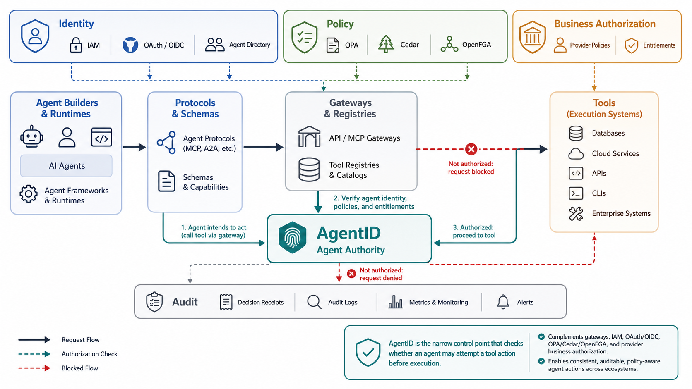

# AgentID Ecosystem Positioning

AgentID exists to make agent tool execution reviewable, enforceable, and
auditable across provider-hosted MCP tools, enterprise MCP gateways, SaaS apps,
cloud control planes, databases, and internal systems.

The business requirement is simple:

> AgentID must make MCP and agent tool ecosystems safe enough for enterprise
> adoption by turning tool authority into a portable, reviewable, enforceable
> contract shared between providers and enterprises.



## The gap

MCP makes APIs callable by agents. That is useful, but it changes the risk model
for every API provider and enterprise platform team.

OAuth can prove that a caller may reach an MCP server. MCP tool schemas can
describe the inputs a tool accepts. Tool annotations can hint at behavior.
Gateways can route and observe calls. Policy engines can decide whether a user
or tenant may perform a business operation.

None of those, by themselves, answers the agent-specific question:

> Should this agent attempt this tool action on this resource, for this user,
> job, customer, approval, and time window?

AgentID fills that gap with an authorization contract for agent tool execution.

## Where AgentID fits

AgentID is the agent authority layer between identity and execution:

```text
Agent or app runtime
  -> gateway, app runtime, or tool host
  -> AgentID authorization contract and runtime check
  -> business authorization
  -> SaaS, internal, cloud, database, or MCP tool
```

For provider-hosted MCP tools, AgentID supports a two-sided model:

```text
Provider publishes MCP tool contract
  -> enterprise imports and reviews it
  -> enterprise gateway authorizes the agent action
  -> provider MCP server verifies the receipt
  -> provider applies business authorization
  -> tool executes
```

The provider describes tool semantics, blast radius, protected resources,
receipt requirements, approval expectations, and provider-side constraints. The
enterprise overlays local policy for agents, users, jobs, cases, customers,
data flows, approvals, and JIT grants.

## Ecosystem boundary

AgentID is not another agent framework, protocol, gateway, identity provider,
policy engine, or tool host. It is the authority contract that those components
can share before an agent-originated tool action executes.

- **Agent builders and runtimes:** LangChain, LlamaIndex, AutoGen, CrewAI,
  OpenAI Agents SDK, IDE agents, and desktop agents decide how agents plan,
  reason, and call tools. AgentID constrains which tool actions those agents
  may attempt.
- **Protocols and schemas:** MCP, A2A, OpenAPI, JSON Schema, and tool
  annotations describe tools, inputs, resources, and interactions. AgentID adds
  authority semantics to those descriptions.
- **Gateways and registries:** agentgateway, ContextForge, MCP gateways, Envoy,
  Kong, API gateways, and tool catalogs make tools discoverable, routable,
  federated, proxied, and observable. AgentID gives them a reviewable contract
  and runtime decision point.
- **Identity and access:** OAuth, OIDC, JWT, IAM, SPIFFE/SPIRE, and customer
  IdPs prove who is calling and which server can be reached. AgentID uses
  identity as input, but does not treat identity as sufficient authority.
- **Policy and authorization:** OPA, Cedar, OpenFGA, RBAC, application
  entitlements, and provider policies decide whether a user, tenant, account,
  or app may perform the underlying business operation. AgentID complements
  them with agent-specific eligibility.
- **Execution systems:** provider MCP servers, SaaS APIs, internal services,
  cloud control planes, databases, and queues perform the actual read, write,
  send, refund, deploy, delete, or export. AgentID runs before execution; the
  provider or app still makes the final business decision.
- **Audit and observability:** OpenTelemetry, SIEM, audit logs, billing meters,
  and provider execution receipts explain what happened and how it can be
  reviewed. AgentID emits decisions, denials, JIT grants, receipts, drift
  findings, and correlation handles.

The clean boundary is:

- identity systems answer who is calling
- gateways answer how the call is routed and mediated
- business authorization answers what the user or tenant may do
- AgentID answers what the agent may attempt, for this job and approval state
- the provider or application still decides whether the underlying operation
  executes

## What AgentID is not

AgentID is not:

- another API-to-MCP wrapper
- another MCP gateway
- another IAM system
- a replacement for OAuth, OIDC, or customer identity providers
- a replacement for OPA, Cedar, OpenFGA, RBAC, or application authorization
- a replacement for provider-side tenant isolation and business rules
- a generic agent identity registry
- a billing, metering, or observability system

AgentID should make these systems more useful for agentic execution by giving
them a shared, reviewable contract for agent authority.

## Primary users

The first user is a SaaS or API provider that wants to expose write-capable MCP
tools to enterprise customers without asking those customers to accept broad,
ambiguous authority.

The second user is an enterprise AI platform or security team that needs a
reviewable contract before approving agents to use internal, SaaS, cloud,
database, or provider-hosted MCP tools.

MCP gateway builders are a third audience. They need a policy artifact and
runtime decision path before forwarding `tools/call` requests.

## Provider value

AgentID should help providers:

- make high-impact MCP tools acceptable to enterprise customers
- publish stable authorization requirements alongside tool schemas
- identify which tool arguments map to protected resources
- require scoped receipts before high-blast-radius execution
- keep provider business authorization in the execution path
- preserve entitlements, quotas, usage metering, billing controls, and rate
  limits as APIs become agent-callable tools
- provide audit handles that connect enterprise authorization to provider
  execution
- reduce repeated security-review friction for each enterprise customer

The provider owns tool semantics. That means the provider is best positioned to
publish the base contract for action, risk, protected resources, receipt
bindings, approval expectations, provider-side constraints, and billable usage
dimensions.

## Enterprise value

AgentID should help enterprises:

- review agent authority before enabling tools
- import provider contracts instead of reverse-engineering risk from tool
  schemas
- constrain tool calls by agent, user, job, case, customer, resource, approval,
  and time window
- avoid broad standing authority for write, admin, execute, financial,
  external-send, deletion, export, and regulated-data actions
- enforce policy at an MCP gateway, app runtime, or internal tool boundary
- require approval or JIT authority for monetized, high-cost, or high-risk
  actions
- produce audit evidence for approvals, JIT grants, decisions, denials, and
  tool execution
- detect MCP tool drift before newly exposed tools become available to agents

## Adoption motion

The preferred adoption loop is:

1. Provider publishes `provider-mcp-contract.yaml`.
2. Enterprise validates and reviews the contract.
3. Enterprise imports it into a tenant or agent manifest.
4. Gateway, app runtime, or tool host checks AgentID before tool execution.
5. Sensitive calls receive short-lived, scoped JIT authority.
6. Provider verifies the forwarded receipt before high-risk execution.
7. Provider applies tenant isolation, product rules, entitlements, quotas,
   metering, billing, and business authorization.
8. Both sides keep audit handles for review, support, and compliance.

The demo path should be runnable in minutes. The production path should map to
existing IdPs, gateways, policy engines, audit pipelines, provider business
authorization, and provider monetization systems.

## API monetization requirements

AgentID provider contracts should preserve provider API monetization when APIs
are exposed as MCP tools.

Provider contracts should be able to describe billable tools, usage dimensions,
quota scope, entitlement requirements, metering identifiers, and
spend-sensitive constraints. Enterprise policy should be able to require
approval or JIT authority for monetized or high-cost actions, while provider
systems remain the source of truth for plan checks, quota enforcement, overage
handling, metering, and billing events.

AgentID receipts should carry enough context to correlate an enterprise-side
authorization decision with provider-side metering and execution audit, without
making AgentID the billing system.

Useful contract concepts include:

- whether a tool is billable
- usage dimensions such as calls, records read, exports, workflow runs,
  messages sent, credits issued, or compute time
- tenant, customer, account, user, and resource identifiers needed for
  entitlement and billing checks
- quota scope, such as tenant, workspace, user, account, or resource
- provider meter identifiers for billable events
- spend controls, amount limits, approval thresholds, and JIT requirements
- provider-side rate limits, overage handling, and billing-event emission

AgentID should protect both enterprise risk boundaries and provider
business-model boundaries when APIs become agent-callable tools. The provider
retains final authority over entitlements, quotas, metering, billing, and
execution.

## Trust requirements

AgentID must be credible to security reviewers:

- fail closed for ambiguous high-risk actions
- classify write, admin, execute, financial, external-send, delete, export,
  permission, and regulated-data tools as high blast radius by default
- require explicit approval and short-lived scoped authority for sensitive
  actions
- bind JIT grants and receipts to concrete agent, user, tool, action, resource,
  job, case, customer, approval, and expiration fields when present
- preserve provider-side authorization as mandatory
- make policy changes reviewable in pull requests
- produce audit records that security, compliance, platform, and provider teams
  can understand

## Success metrics

Useful success metrics include:

- a provider can publish a reviewed first AgentID MCP contract in under 30
  minutes
- an enterprise can validate, inspect, and import a provider contract in under
  10 minutes in the demo path
- high-risk provider tools are blocked by default unless JIT, approval, receipt,
  and binding requirements are present
- CI catches risky MCP tool drift before release
- gateway decisions produce audit records suitable for security review
- providers can give enterprise customers a clear authorization story for
  write-capable MCP tools

## Repeatable language

Short phrases that describe AgentID's role:

- Auth-first MCP
- Agent-safe API exposure
- MCP tools with blast-radius contracts
- Provider-verified agent actions
- Receipts for agent tool execution
