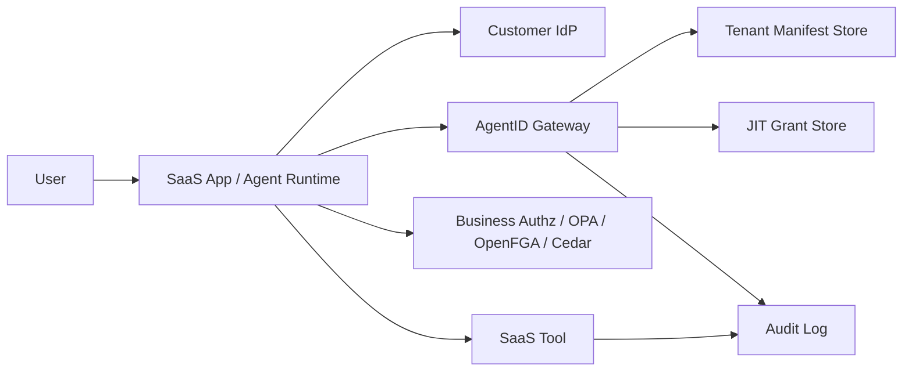

# SaaS Integration Patterns

AgentID is intended to sit in the narrow path between an agent runtime and the
tools it wants to call. It should answer one runtime question:

> Is this agent eligible to request this tool action, with this data flow, for
> this tenant, user, resource, approval state, and time window?

It does not replace your identity provider, IAM, OPA, OpenFGA, Cedar, MCP
gateway, audit pipeline, or business authorization checks. It gives those
systems a shared authority contract for agent behavior.

## Recommended Architecture



Use AgentID as an early guardrail before a tool executes. Keep business-object
authorization in your existing authorization layer.

## Integration Steps

1. Define one AgentID manifest per agent or agent class.
2. Add OIDC issuer, audience, JWKS URI, claim mappings, and required scopes.
3. Store manifests in your control plane or in the Cloudflare gateway KV store.
4. Put an AgentID check immediately before every tool call.
5. Require JIT grants for writes, external sends, financial operations, admin
   actions, destructive changes, and high-risk data movement.
6. Log every decision, denial, JIT issuance, JIT consumption, and downstream
   tool execution.
7. Validate manifests in CI with the AgentID GitHub Action.

## Enforcement Point

The best enforcement point is the code path that already invokes tools:

```ts
await agentid.assertAllowed(tenantId, {
  agent_id: "refund-agent",
  tool: "zendesk.search_tickets",
  action: "read",
  data_from: "zendesk",
  data_to: "agent_context",
});

const tickets = await zendesk.searchTickets(query);
```

Do not put the check only at login or session creation. A valid identity token
does not prove that a specific tool call is safe.

## Sensitive Actions and JIT Grants

For sensitive actions, split the workflow into two checks:

1. Confirm the agent may request approval or notification.
2. Issue a scoped JIT grant only after the required approval state exists.
3. Consume the JIT grant when the tool call executes.

```ts
const grant = await agentid.requestJitGrant(tenantId, {
  tool: "stripe.create_refund",
  action: "write",
  resource: "refund/case-1042",
  approval_id: "approval-123",
  user_id: "support-rep-17",
});

await agentid.assertAllowed(tenantId, {
  agent_id: "refund-agent",
  tool: "stripe.create_refund",
  action: "write",
  resource: "refund/case-1042",
  approved: true,
  jit_grant_id: grant.jit_grant_id,
});

await stripe.refunds.create({ charge: chargeId, amount: 8700 });
```

JIT grants should be short-lived, single-use, and bound to agent, user, tool,
action, resource, approval, and tenant.

## Multi-Tenant SaaS Pattern

For a SaaS product, treat the tenant manifest as customer configuration:

- Customer chooses or reviews the agent manifest.
- Your app stores the manifest under the tenant ID.
- The gateway validates the caller token against the tenant manifest.
- The gateway enforces tenant, user, agent, audience, scope, tool, approval,
  JIT, and data-flow constraints.
- Your app executes the tool only after an allow decision.

With the Cloudflare gateway, store each tenant manifest as JSON in the
`AGENTID_MANIFESTS` KV namespace under the tenant ID used in:

```text
POST /tenants/<tenant-id>/authorize
POST /tenants/<tenant-id>/jit-grants
```

## OIDC and Identity Providers

Production deployments should validate access tokens from the customer's IdP:

- `issuer` identifies the trusted IdP.
- `audiences` identifies the gateway or API audience.
- `jwks_uri` provides the public keys for RS256 validation.
- `claim_mappings` map token claims to tenant, user, and agent identity.
- `required_scopes` separate policy read, authorization, and JIT issuance.

AgentID should reject a request if the token validates cryptographically but
does not map to the expected tenant, agent, audience, or scopes.

## Relationship to OPA, Cedar, and OpenFGA

AgentID is most useful as the agent authority layer:

- May this agent call this tool?
- May this agent call another agent?
- Is this action allowed for this agent's declared purpose?
- Is this source-to-destination data flow allowed?
- Does this action require approval or JIT authority?
- Is the presented JIT grant valid for this resource?

OPA, Cedar, OpenFGA, and application authorization remain good places for
business-object decisions:

- May this user view this account?
- May this support rep refund this customer?
- May this team deploy this service?
- May this role update this billing setting?

In production, use both. AgentID constrains the agent's runtime authority;
your existing authorization system constrains the underlying business action.

## Agent-to-Agent Delegation

AgentID supports scoped checks for agent-to-agent calls. Use this when one
agent may ask a specialist agent to perform a narrow part of a workflow.

The important constraint is that delegation should be narrower than the source
agent's authority. For example, a refund agent may delegate billing-history
lookup to a risk-review agent, but not Stripe refund execution:

```yaml
delegation_chain:
  may_call_agents: true
  allowed_agents:
    - refund-risk-review-agent
  max_depth: 1
  allowed_delegated_tools:
    - billing.lookup_refunds
    - zendesk.search_tickets
  requires_approval: true
  approval_sources:
    - human
    - agent
  approval_agents:
    - delegation-policy-agent
  delegation_ttl_seconds: 300
```

The current gateway enforces declared `called_agent`, `delegated_tool`,
`delegation_depth`, `approval_source`, `approval_agent`, and approval fields
when they are present on an authorize request. This lets an app validate the
hand-off before one agent calls another. A complete transferable-privilege
model should add durable delegation grants, source/target manifest
intersection, grant revocation, and delegation audit events.

See [`agent-to-agent-delegation.md`](agent-to-agent-delegation.md) for the
full model and [`../examples/customer-support-delegation-agent.yaml`](../examples/customer-support-delegation-agent.yaml)
for a refund-case manifest.

## CI and Review

Add the GitHub Action to the repository that owns your agent manifests:

```yaml
name: AgentID Check

on: [pull_request]

jobs:
  agentid:
    runs-on: ubuntu-latest
    steps:
      - uses: actions/checkout@v4
      - uses: dinpd/AgentID@main
        with:
          manifests: "agents/*.yaml"
          max-risk: "75"
```

This gives reviewers a manifest validation and risk threshold check before
runtime authority changes merge.

## Rollout Checklist

- Start with observe-only logging around tool calls.
- Add `assertAllowed` before low-risk read actions.
- Add data-flow constraints for sensitive systems.
- Add JIT grants for writes and financial actions.
- Add denials to alerting and support dashboards.
- Add the GitHub Action to require manifest review.
- Move high-risk tenants to production OIDC/JWKS validation.
- Document the human approval process for every JIT action.
