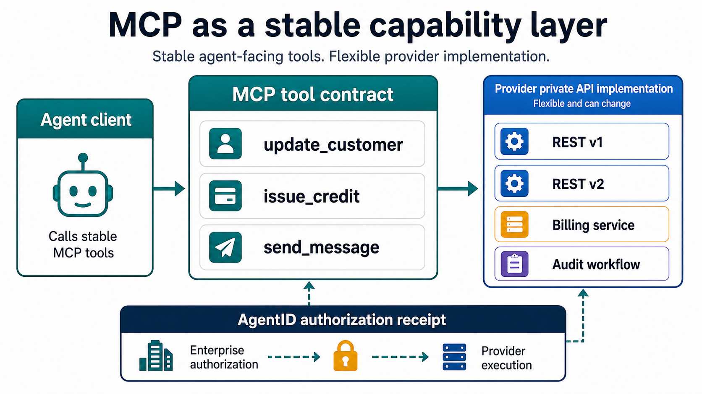

# MCP Gives Providers a Stable Capability Layer for Agents



Most of the conversation around MCP focuses on making APIs callable by agents.

That matters. But for API providers, there is a second benefit that may be even
more important:

MCP lets providers expose stable agent-facing capabilities without forcing
every client to track the provider's internal API implementation.

Without MCP, an agent client often ends up coupled to the provider's API shape:

```text
Agent client -> PATCH /v1/customers/{id}
Agent client -> POST /v1/billing/credits
Agent client -> POST /v1/messages/send
```

If the provider changes endpoint paths, payload shapes, auth flows, internal
services, orchestration, or API versions, the customer may need to update the
client and send the change through internal review.

That is expensive. It is also the wrong boundary.

With MCP, the agent calls a durable provider capability:

```text
Agent client -> tools/call provider.crm.update_customer
             -> tools/call provider.billing.issue_credit
             -> tools/call provider.email.send_message
```

The provider MCP server handles the implementation behind that capability.

The provider can move from one REST endpoint to three internal service calls. It
can change a backend route, split a service, migrate API versions, add audit
workflows, or change database schema. As long as the MCP tool name, input
contract, output behavior, and semantics remain stable, the agent client does
not need to change.

That is the real decoupling value:

```text
MCP tool = stable callable capability
Provider API = private implementation detail
```

For providers, this is a better abstraction boundary than asking every
enterprise customer to understand the underlying API implementation.

## MCP Moves Change Management to the Right Place

MCP does not make change management disappear. It moves it to the interface that
actually matters to an agent.

No enterprise review should be needed when the provider changes implementation
details behind a stable MCP tool:

- endpoint paths
- internal service topology
- database schema
- API version used by the MCP server
- implementation language
- backend vendor
- orchestration from one API call to many

Enterprise review should happen when the provider changes the agent-facing
capability:

- a tool name changes
- required arguments change
- output behavior changes incompatibly
- the meaning of the action changes
- new side effects are added
- risk increases
- resource binding changes
- data starts flowing to a new destination
- approval or authorization requirements change

That distinction is important.

An enterprise AI platform team should not need a review cycle because a provider
renamed an internal REST route. It should need review if a tool that used to
read invoices can now issue credits.

MCP gives providers a stable capability layer. But stable capability is only
half of the story.

The other half is authority.

## Tool Schemas Describe Shape, Not Authority

An MCP tool schema can describe what inputs a tool accepts:

```text
customer_id
amount_usd
reason
case_id
```

That is useful. But it does not answer the question that matters before a
high-impact tool executes:

Should this agent execute this action on this resource for this user, job,
customer, approval, and time window?

That question becomes critical when provider-hosted MCP tools can:

- update durable customer data
- issue credits or refunds
- send messages
- change roles or permissions
- export sensitive data
- delete records
- trigger workflows or deployments

For those tools, OAuth access to the MCP server is necessary, but not enough. A
valid client credential proves access to the server. It does not prove that this
agent should perform this action on this resource in this business context.

That is where an authorization contract belongs.

## Provider MCP Needs Authorization Contracts

For provider-hosted MCP tools, the provider should publish the base
authorization contract.

The provider is the source of truth for what a tool does:

- the action classification: read, write, admin, execute
- the protected resource mapping
- the required context
- the risk level
- the approval or just-in-time requirements
- the receipt fields that must be bound before execution
- the provider-side constraints that still apply

The enterprise then imports or reviews that contract and overlays local policy:

- which agents may use the tool
- which users they may act for
- which jobs, cases, and customers are in scope
- which data flows are allowed
- which approval workflow is required
- how audit records should be retained

That creates a cleaner division of responsibility:

```text
Provider publishes MCP capability and authorization requirements
Enterprise gateway authorizes the agent for the current job
Provider verifies the scoped receipt before execution
Provider still applies business authorization
```

The receipt is the bridge between the enterprise decision and the provider
execution.

For example, a support agent trying to update a customer record might carry a
receipt bound to:

```text
tenant_id
agent_id
user_id
tool
action
resource
job_id
case_id
customer_id
approval_id
jit_grant_id
issued_at
expires_at
```

The provider MCP server can reject calls with missing, expired, mismatched, or
reused receipts before touching the underlying API.

The provider still checks tenant isolation, delegated-user permissions, product
rules, rate limits, fraud limits, and business constraints. The receipt does
not replace provider authorization. It proves that the enterprise authorized the
agent-originated request.

## The Provider Benefit

This is why MCP is a strong primitive for providers.

It is not just "API to tool."

It is:

```text
Stable agent-facing capability
+ private API implementation behind it
+ explicit authorization contract around it
+ provider-side receipt verification before execution
```

That model gives providers room to evolve their APIs without forcing every
enterprise agent client through change management for implementation details.

It also gives enterprise customers a reviewable boundary for what actually
matters:

- what can the agent call?
- what can the tool do?
- what resource does it affect?
- what approval is required?
- what data can move?
- what receipt must be present?
- what audit handle connects authorization to execution?

MCP is the known surface. Provider action authority is the durable layer
underneath it.

That is the positioning I think will matter most:

**Turn your API into MCP without giving agents a blank check.**

Expose stable provider capabilities. Keep your implementation free to evolve.
Require scoped authorization receipts for high-blast-radius actions. Let
enterprise customers approve the capability, not every private API detail behind
it.
