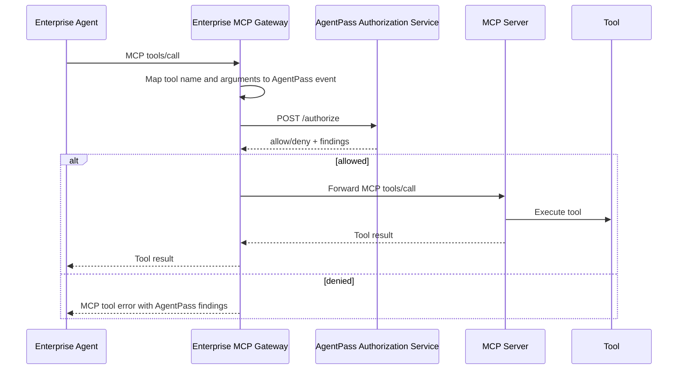

# MCP Gateway Integration

AgentPass is a natural fit for enterprise-controlled MCP gateways. The gateway
already sits between an agent and tools, so it is the right place to ask whether
a tool call should proceed.

```text
Enterprise Agent -> Enterprise MCP Gateway -> AgentPass Check -> Internal or Provider MCP Server
```

AgentPass is not required to be the network gateway or MCP proxy. In this
topology, the enterprise MCP gateway or app runtime calls AgentPass as an
authorization decision service before forwarding tool calls, or embeds the
local guard when the gateway and policy state live in the same runtime.

The enterprise owns the gateway and the AgentPass manifest. The downstream MCP
server may be an internal enterprise server or a provider-hosted server.

## Why This Matters

MCP servers make tools easy to expose, but enterprises still need a local
control point for:

- Which agents may call which internal or provider tools.
- Which jobs, cases, customers, and resources those calls may touch.
- Which data may move between enterprise systems, SaaS APIs, and providers.
- Which writes, sends, deploys, payments, or admin actions require approval.
- Which sensitive calls require short-lived JIT grants.
- Which tool changes count as unreviewed drift.
- Which audit events the enterprise keeps independently of the provider.

AgentPass supplies the reviewable authority contract and runtime check for that
control point.

## Request Flow



For sensitive calls, the gateway should request or require a JIT grant before
forwarding the MCP call:

```text
MCP Gateway -> AgentPass /jit-grants -> AgentPass /authorize with jit_grant_id -> MCP Server
```

The important constraint is that enforcement happens at call time, immediately
before the downstream `tools/call` is forwarded. AgentPass should not be framed
as a generic MCP client-side authorization preflight. It is a runtime admission
gate that can run inside a gateway, app runtime, provider boundary, or external
policy decision service.

## Mapping MCP Calls to AgentPass

An MCP `tools/call` request has a tool name and arguments. The gateway maps
those into an AgentPass authorization event:

```json
{
  "agent_id": "enterprise-support-agent",
  "tool": "provider.crm.update_customer",
  "action": "write",
  "job_id": "support_case_resolution",
  "case_id": "case-1042",
  "customer_id": "cus_123",
  "resource": "provider/customer/cus_123",
  "data_from": "enterprise_crm",
  "data_to": "provider_crm",
  "approved": true,
  "jit_grant_id": "grant-123"
}
```

The gateway can derive these fields from:

- MCP tool name.
- MCP tool arguments.
- Enterprise session context.
- OIDC claims.
- The current job or workflow state.
- A per-tool mapping config.

When the client reached the MCP server through enterprise-managed authorization,
the gateway should also pass the enterprise auth context into AgentPass. That
context can include the IdP issuer, subject, client ID, scopes, groups, token
audience, and ID-JAG grant identifier. AgentPass can then enforce global or
per-tool requirements such as `requiredScopes`, `requiredGroups`,
`allowedGroups`, `allowedClients`, and `allowedIssuers` before forwarding the
`tools/call`.

```ts
await gate.run(
  mcpToolsCallRequest,
  {
    agentId: "enterprise-support-agent",
    tenantId: "tenant-a",
    userId: "user-17",
    enterpriseAuth: {
      issuer: "https://idp.example.com",
      subject: "user-17",
      clientId: "claude-enterprise",
      scopes: ["openid", "mcp:provider-crm", "crm.write"],
      groups: ["support", "support-admins"],
      idJagGrantId: "id-jag-1"
    }
  },
  forwardMcpToolCall
);
```

For provider-hosted high-risk tools, the gateway also binds that context into
the scoped provider authorization receipt using flat fields such as
`enterprise_issuer`, `enterprise_subject`, `enterprise_client_id`,
`enterprise_token_audience`, `enterprise_id_jag_grant_id`,
`enterprise_scopes`, and `enterprise_groups`. Provider-side verifiers can mark
those fields as required and require specific values before executing the tool.

## Example Mapping Config

```yaml
provider: example-crm
server: provider-crm-mcp

tools:
  provider.crm.search_customer:
    action: read
    data_from: provider_crm
    data_to: agent_context
    resource_arg: customer_id
    job_id_arg: job_id
    case_id_arg: case_id
    customer_id_arg: customer_id

  provider.crm.update_customer:
    action: write
    data_from: enterprise_crm
    data_to: provider_crm
    resource_template: provider/customer/{customer_id}
    job_id_arg: job_id
    case_id_arg: case_id
    customer_id_arg: customer_id
    requires_jit: true
```

This config is not required by the current gateway, but it is the shape a
reference MCP gateway adapter should support.

## Manifest Pattern

The corresponding AgentPass manifest should declare downstream MCP tools explicitly:

```yaml
tools:
  - name: provider.crm.search_customer
    access: read
    auth_mode: delegated
    approval: none

  - name: provider.crm.update_customer
    access: write
    auth_mode: just_in_time
    approval: human_confirm
    constraints:
      token_ttl_seconds: 300
      resource: provider/customer/*

data_flows:
  - from: enterprise_crm
    to: provider_crm
    allowed: true

  - from: customer_records
    to: provider_external_email
    allowed: false
```

See [`../examples/provider-mcp-support-agent.yaml`](../examples/provider-mcp-support-agent.yaml)
for a complete example.

## Boundary of Responsibility

AgentPass controls the enterprise-side authorization decision before the gateway
forwards the call:

- Agent identity.
- Job boundary.
- Tool/action allowlist.
- Data-flow policy.
- Approval and JIT requirements.
- Agent-to-agent hand-off policy.
- Enterprise audit trail.

The downstream MCP server still controls its own behavior:

- Server authentication.
- Business authorization.
- Rate limits.
- Tool implementation.
- Server audit and retention.

Use both. AgentPass prevents unapproved outbound calls from the enterprise gateway
or app runtime; internal systems and providers still enforce their own platform
rules.

For provider-hosted MCP servers, there is a second useful enforcement point: the
provider can verify that forwarded calls include a scoped enterprise
authorization receipt before executing sensitive tools. See
[`provider-mcp-authorization.md`](provider-mcp-authorization.md) for the
provider-side contract, grounded CRM/billing use case, and execution plan.

For these provider-hosted tools, the base authorization contract should start
with the provider: tool semantics, protected-resource mappings, required
authorization context, blast-radius classification, JIT expectations, and
receipt requirements. The enterprise gateway should consume that contract and
add tenant-specific agent, job, approval, and data-flow policy before forwarding
calls.

## Reference Adapter Scope

The repository includes a minimal reference adapter in
[`../mcp-gateway-adapter/`](../mcp-gateway-adapter/). It:

- Proxies `tools/list` from a downstream MCP server.
- Intercepts `tools/call`.
- Maps tool name and arguments to an AgentPass authorization event.
- Calls AgentPass `/authorize` or runs the local guard in-process.
- Returns an MCP tool error on deny.
- Forwards the call to the downstream MCP server on allow.
- Preserves process-local job state in local guard mode to demonstrate
  duplicate-side-effect prevention, tool-thrashing limits, and PII egress
  policy before forwarding.

Production hardening should add authentication, transport variants, streaming,
cancellation, retries, richer MCP errors, JIT grant issuance, audit logging,
provider-specific argument mappers, and tool drift detection.

The local guard path is the quickest standards-facing demo:

```bash
cd mcp-gateway-adapter
npm install
npm test
npm run demo:local-guard
```

For the manual proxy demo, start the mock provider and local guard adapter in
separate terminals:

```bash
npm run mock-provider
npm run dev:local-guard
```

Then repeat
[`local-allowed-issue-credit.json`](../mcp-gateway-adapter/examples/local-allowed-issue-credit.json).
The first call forwards to the mock provider and the second is denied at the
gateway because the idempotency key has already been consumed. Send
[`local-denied-pii-email.json`](../mcp-gateway-adapter/examples/local-denied-pii-email.json)
to see PII egress blocked before any downstream tool sees the payload.

For the standards-facing mapping of this adapter to MCP interceptor and PDP
vocabulary, see [`mcp-interceptor-pdp-shape.md`](mcp-interceptor-pdp-shape.md).
