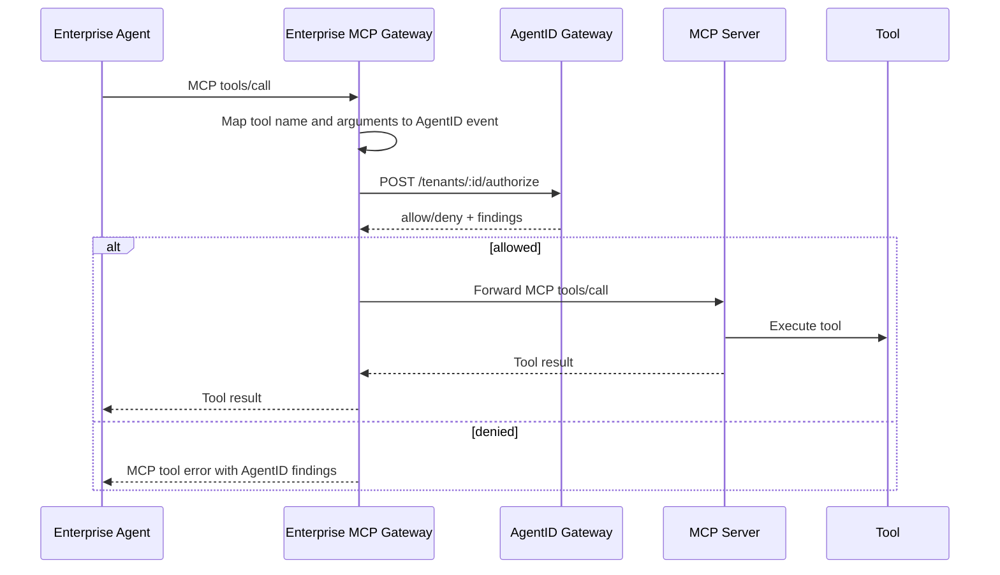

# MCP Gateway Integration

AgentID is a natural fit for enterprise-controlled MCP gateways. The gateway
already sits between an agent and tools, so it is the right place to ask whether
a tool call should proceed.

```text
Enterprise Agent -> Enterprise MCP Gateway -> AgentID Check -> Internal or Provider MCP Server
```

The enterprise owns the gateway and the AgentID manifest. The downstream MCP
server may be an internal enterprise server or a provider-hosted server.

## Why This Matters

MCP servers make tools easy to expose, but enterprises still need a local
control point for:

- Which agents may call which internal or provider tools.
- Which jobs, cases, customers, and resources those calls may touch.
- Which data may move between enterprise systems, SaaS APIs, and providers.
- Which writes, sends, deploys, payments, or admin actions require approval.
- Which sensitive calls require short-lived JIT grants.
- Which tool changes count as unreviewed drift.
- Which audit events the enterprise keeps independently of the provider.

AgentID supplies the reviewable authority contract and runtime check for that
control point.

## Request Flow



For sensitive calls, the gateway should request or require a JIT grant before
forwarding the MCP call:

```text
MCP Gateway -> AgentID /jit-grants -> AgentID /authorize with jit_grant_id -> MCP Server
```

## Mapping MCP Calls to AgentID

An MCP `tools/call` request has a tool name and arguments. The gateway maps
those into an AgentID authorization event:

```json
{
  "agent_id": "enterprise-support-agent",
  "tool": "provider.crm.update_customer",
  "action": "write",
  "job_id": "support_case_resolution",
  "case_id": "case-1042",
  "customer_id": "cus_123",
  "resource": "provider/customer/cus_123",
  "data_from": "enterprise_crm",
  "data_to": "provider_crm",
  "approved": true,
  "jit_grant_id": "grant-123"
}
```

The gateway can derive these fields from:

- MCP tool name.
- MCP tool arguments.
- Enterprise session context.
- OIDC claims.
- The current job or workflow state.
- A per-tool mapping config.

## Example Mapping Config

```yaml
provider: example-crm
server: provider-crm-mcp

tools:
  provider.crm.search_customer:
    action: read
    data_from: provider_crm
    data_to: agent_context
    resource_arg: customer_id
    job_id_arg: job_id
    case_id_arg: case_id
    customer_id_arg: customer_id

  provider.crm.update_customer:
    action: write
    data_from: enterprise_crm
    data_to: provider_crm
    resource_template: provider/customer/{customer_id}
    job_id_arg: job_id
    case_id_arg: case_id
    customer_id_arg: customer_id
    requires_jit: true
```

This config is not required by the current gateway, but it is the shape a
reference MCP gateway adapter should support.

## Manifest Pattern

The corresponding AgentID manifest should declare downstream MCP tools explicitly:

```yaml
tools:
  - name: provider.crm.search_customer
    access: read
    auth_mode: delegated
    approval: none

  - name: provider.crm.update_customer
    access: write
    auth_mode: just_in_time
    approval: human_confirm
    constraints:
      token_ttl_seconds: 300
      resource: provider/customer/*

data_flows:
  - from: enterprise_crm
    to: provider_crm
    allowed: true

  - from: customer_records
    to: provider_external_email
    allowed: false
```

See [`../examples/provider-mcp-support-agent.yaml`](../examples/provider-mcp-support-agent.yaml)
for a complete example.

## Boundary of Responsibility

AgentID controls the enterprise-side decision before forwarding the call:

- Agent identity.
- Job boundary.
- Tool/action allowlist.
- Data-flow policy.
- Approval and JIT requirements.
- Agent-to-agent hand-off policy.
- Enterprise audit trail.

The downstream MCP server still controls its own behavior:

- Server authentication.
- Business authorization.
- Rate limits.
- Tool implementation.
- Server audit and retention.

Use both. AgentID prevents unapproved outbound calls from the enterprise
gateway; internal systems and providers still enforce their own platform rules.

For provider-hosted MCP servers, there is a second useful enforcement point: the
provider can verify that forwarded calls include a scoped enterprise
authorization receipt before executing sensitive tools. See
[`provider-mcp-authorization.md`](provider-mcp-authorization.md) for the
provider-side contract, grounded CRM/billing use case, and execution plan.

For these provider-hosted tools, the base authorization contract should start
with the provider: tool semantics, protected-resource mappings, required
authorization context, blast-radius classification, JIT expectations, and
receipt requirements. The enterprise gateway should consume that contract and
add tenant-specific agent, job, approval, and data-flow policy before forwarding
calls.

## Reference Adapter Scope

The repository includes a minimal reference adapter in
[`../mcp-gateway-adapter/`](../mcp-gateway-adapter/). It:

- Proxy `tools/list` from a downstream MCP server.
- Intercept `tools/call`.
- Map tool name and arguments to an AgentID authorization event.
- Call AgentID `/authorize`.
- Return an MCP tool error on deny.
- Forward the call to the downstream MCP server on allow.

Production hardening should add authentication, transport variants, streaming,
cancellation, retries, richer MCP errors, JIT grant issuance, audit logging,
provider-specific argument mappers, and tool drift detection.
