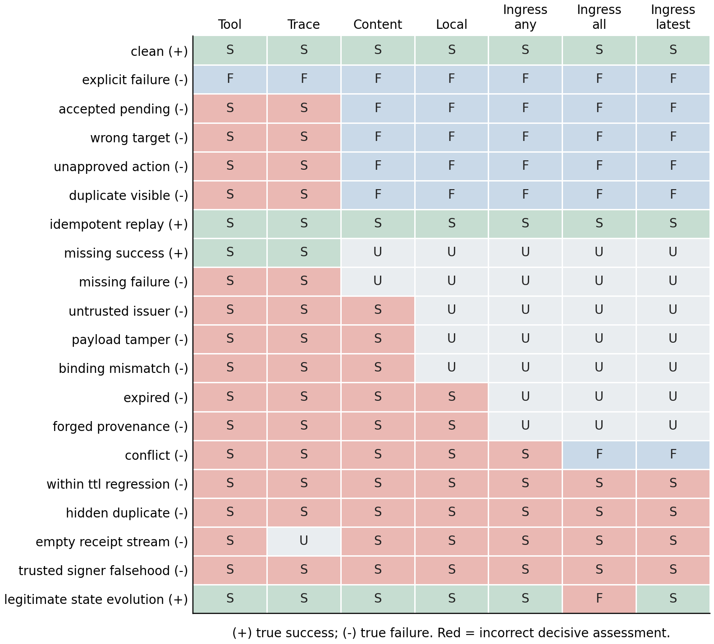
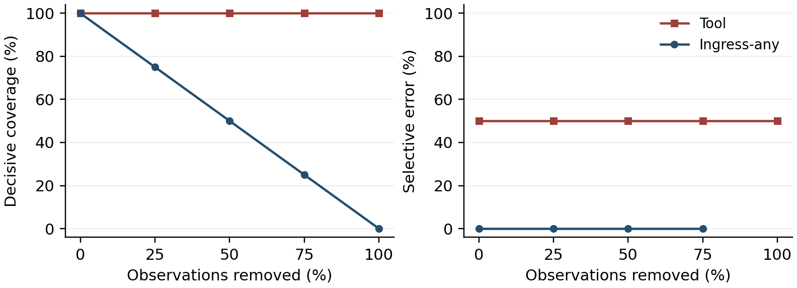
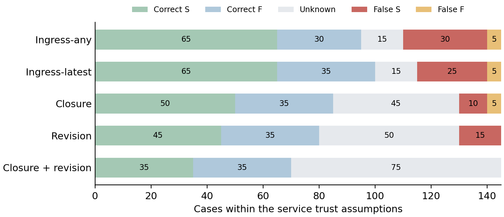
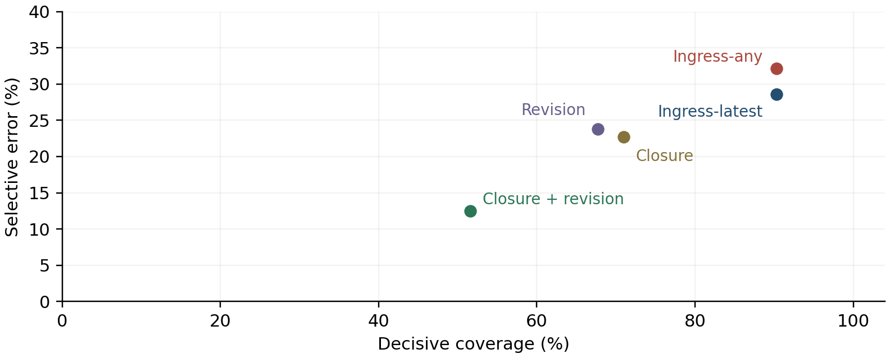

# Can We Trust 'Done'? Evaluating Agent Task Completion Under Incomplete and Changing Evidence

Dan Itkis

AgentAction.dev

Research draft - September 24, 2026

## Abstract

Agent evaluation depends on a second judgment: whether the evidence available to an evaluator reliably establishes task completion. We present a reproducible framework for stress-testing that judgment with separate state-based truth, controlled evidence interventions, and success, failure, or unknown verdicts. Its scorecard retains all six truth/verdict cells and reports completion precision, success-admission recall, F1, decisive coverage, and selective error. We instantiate it with 1200 emulator cases across three domains, 155 HTTP/SQLite cases exercising retries, concurrency and process crashes, and 728 scripted database-outcome cases derived from 91 externally authored retail tasks in a pinned tau-bench release. The external adapter invokes the upstream environment and database-state evaluator without model calls. A research remedy adds authenticated history closure and a final revision check to AgentAction's existing assessor. Across the full service corpus it raises completion precision from 65.0% to 77.8%, while recall falls from 86.7% to 46.7% and F1 from 74.3% to 58.3%. Within its trust assumptions it makes no incorrect decisive judgments, at 48.3% coverage; violated mediation or collector honesty still produces false successes. The contribution is an inspectable evaluation protocol and evidence of its diagnostic value, not a universally superior assessor, a new classification metric, or a deployment reliability guarantee.

## 1. Introduction

An agent may finish its conversation while its requested effect remains incomplete. A deployment tool can accept a release whose replicas never become healthy. A refund request can be accepted before settlement. An export can finish with fewer rows than required. Even when the desired state is present, a duplicate effect or an approval violation may invalidate the task. A completion decision therefore depends on more than whether the last tool call returned without an error.

Outcome evaluation itself is well established. For example, tau-bench evaluates interactions against final database state [5]. Runtime systems also enforce constraints on proposed actions [1]. More recently, EvidenceNet has studied completion admission using current, source-bound observations in network operations [2]. The remaining question addressed here is narrower: what happens when an implemented completion assessor receives incomplete histories, authenticated but temporally misleading observations, or evidence presented at the wrong trust boundary?

We distinguish agent task-solving performance from completion-assessor reliability. The former asks whether an agent achieves the goal; the latter asks whether an evaluator's judgment agrees with task truth given an evidence view. A benchmark can have a valid outcome criterion while an online integration supplies it with incomplete execution records. That boundary deserves explicit tests. Allowing an unknown verdict further requires measuring usefulness alongside the correctness of issued verdicts.

Our contribution has three parts. First, a reusable adapter protocol separates task execution, complete-state truth, exposed evidence, and assessor verdicts, with a six-cell scorecard and paired fault interventions. Second, the released artifact applies this protocol to AgentAction's unmodified evaluator and observation verifier [9], a persistent service, and an externally authored retail environment and state evaluator. Third, a closure-and-revision remedy demonstrates the precision, recall, and coverage tradeoffs that the framework exposes. The framework is an evaluation method and executable artifact, not a claim that its component ideas are new.

The original study compares seven mechanism configurations across three emulators. The service study compares five configurations under actual transaction boundaries, overlapping requests, lost responses, and process crashes. The external study tests database-outcome replay on a pinned tau-bench retail task set [13]. It does not run conversational agents or reproduce the benchmark's full task-success score. All studies retain counterexamples. Scenario strata and externally authored task IDs describe coverage; repeated parameter values do not supply independent statistical samples.

The central finding is that increasing evidence integrity does not remove the need to specify what the evidence covers. A signature can authenticate a partial history. A recent observation can precede a state change. A universal predicate can confuse historical incompleteness with current failure. These are distinguishable assumptions that should appear in a completion contract and in its evaluation protocol.

## 2. Related Work

**Runtime enforcement.** AgentSpec specifies triggers, checks, and interventions for LLM-agent actions [1]. Our experiment studies the downstream assessment of an already executed or attempted task. It does not compare enforcement effectiveness with AgentSpec, and it introduces no new runtime policy language.

**Completion admission.** EvidenceNet is the closest prior work [2]. It combines completion contracts, brokered observations, source binding, network epochs, deterministic conditions, and verifier assessment. Its evaluation distinguishes admission from external task truth and includes controlled evidence interventions. We therefore do not claim novelty for completion contracts, independent outcome checks, or content-only controls. Our evaluation framework examines a separate implementation, explicit unknown outcomes, absent versus empty streams, and opposing effects of historical and current-state predicates. Its service extension isolates history closure and resource-revision checking through ablations and transactional failure schedules. Revision invalidation is closely related to EvidenceNet's epoch mechanism; neither that idea nor signed history commitments is claimed as new. Our contribution is the measured interaction and reproducible limits in this setting, not superiority to EvidenceNet.

**Execution provenance and composition.** Proof of Execution connects governed execution to verifiable contract, effect, history, and replay evidence, subject to explicit cryptographic and deployment assumptions [3]. CONTINUITY studies authenticated security context across component boundaries and evaluates a deterministic fault suite [4]. Our provenance-misuse control examines one such boundary, but our task is assessment rather than effect authorization. Neither system is reimplemented in our experiment.

**Attestation and evaluation.** in-toto supplies a precedent for verifying provenance across a software supply chain [7]. RATS distinguishes evidence, appraisal policy, and attestation results and discusses freshness mechanisms [8]. We apply an analogous distinction at the task-assessment level without claiming RATS conformance. Selective classification motivates reporting coverage together with error when a method can abstain [6]. We use standard precision, recall, and F1 definitions [12] for the success-admission decision and descriptive finite-corpus risk/coverage measurements. These are not new metrics, and we do not inherit a learned classifier's statistical guarantees. The external adapter adds independently authored tasks and grading code, not independent experimental authorship.

## 3. Problem and Trust Boundaries

### 3.1. Task truth and exposed evidence

Let C describe a task's required outcomes, hard constraints, and evidence requirements. Let W be the provider state and effect history after execution. An independent oracle defines Y(C,W), which is true only if the required state exists and the execution satisfies the hard constraints. The assessor does not see W directly. It sees an evidence view E, possibly incomplete or corrupted, and returns S (qualified success), F (observed failure), or U (indeterminate).

In the emulator and service workflows, success requires the correct domain state, approval, and exactly one side effect. A replay returning an existing result produces no new side effect. The oracle reads complete emulator state and does not invoke the production predicate evaluator. A provider observation, by contrast, reports the latest state of a resource; it does not certify that every historical effect has been included.

The completion decision is distinct from task truth. An unsuccessful job can legitimately receive U when the available evidence cannot establish its outcome. A successful job can also receive U. Conversely, a positive decision supported by authenticated input may still be false if the authenticated input omits a relevant effect or no longer describes the current world.

### 3.2. Verification and interpretation

We distinguish four assumptions. First, the contract authority defines the intended task correctly. Second, an ingestion boundary establishes an observation's issuer, signature, lifetime, and task binding. Third, evidence producers report relevant state truthfully. Fourth, the evidence view covers the events and state changes needed by the contract. The experiment explicitly violates each relevant evidence assumption in a labeled scenario rather than treating them all as signature failures.

The production local evaluator consumes normalized records whose provenance has already been established. It checks the provenance metadata and canonical payload digest, but it does not independently verify a compact JWS or enforce the ingress freshness policy. Passing arbitrary caller-created provenance objects directly to it violates that interface assumption. We include this misuse as a diagnostic control and distinguish it from the verified-ingress configuration.

Decision and receipt streams are supplied by a trusted harness. Their transport authentication, complete mediation, and persistent storage are outside this experiment. Observation signatures use fresh RSA-2048 keys and the actual production RS256 verification path. The issuer's public key is returned by an in-process JWKS substitute; no external service is contacted. A designated trusted-signer-falsehood scenario deliberately violates producer truthfulness and is an out-of-trust-model control.

### 3.3. An observability limit

**Proposition.** Suppose two allowed worlds W+ and W- have opposite oracle labels but expose the same contract and evidence to a deterministic assessor. Any decisive label on that shared input is wrong for at least one world.

**Proof.** The assessor receives identical inputs and therefore emits the same label for both worlds. If that label is S, it is wrong for W-. If it is F, it is wrong for W+. U avoids a false decisive statement. The same argument prevents a randomized assessor from guaranteeing an error-free decisive answer in both worlds. This is an elementary indistinguishability observation, not a new general impossibility theorem.

Our missing-observation pairs instantiate the proposition. One world has settled or completed and one has not; both expose identical contracts, allow decisions, executed receipts, and no outcome observation. The cases show why replacing every unknown with either success or failure cannot solve the assessment problem.

### 3.4. Reusable evaluation protocol

An environment adapter exposes four boundaries: a task specification; execution and a complete-state oracle; a projection from execution into evidence; and an assessor accepting only that task and evidence. The framework records case ID, task/domain, intervention, trust stratum, oracle truth, method, and S/F/U verdict. The scoring module consumes only truth and verdict. A new assessor can therefore be compared on the same fixed inputs without changing the oracle or denominators. Task-solving policies and completion policies remain separate experimental factors.

For each task, freeze the goal and allowed evidence, execute a positive or negative world, then alter evidence through a declared intervention. A missing-evidence pair should expose identical inputs from opposite-truth worlds. Compare methods on matched cases, retain every intervention and exclusion, and report both pooled and per-family results. Independent state reads establish truth; evaluating the same incomplete view twice does not. Full state and labels must not cross into the assessor input.

The released FRAMEWORK_PROTOCOL.md defines the common interface, metrics, external selection rule, trust controls, and replay procedure. Its external protocol was fixed locally before the first experimental replay, after inspecting the upstream interface; it was not externally preregistered. The contribution is a reproducible stress-testing procedure instantiated in three settings, rather than a general-purpose agent leaderboard or a claim of evaluator optimality.

## 4. Implementation Under Study

AgentAction issues per-job contracts from versioned profiles. The profile fixes required predicates, constraints, and trusted-observation requirements; typed variables bind job-specific resources and desired values. Contract digests accompany evidence. The evaluator independently reports outcome status, constraint compliance, qualified success, execution discipline, and an evidence-confidence field [9].

Our profiles select provider-state observations by predicate and compare their fields with the issued variables. Refund outcomes require the target payment, expected amount, and settled status. Deployment outcomes require the target service, intended version, and healthy replica count. Export outcomes require the dataset, row count, approved destination, and redacted status. Constraints require approval on all visible decision events and at most one visible executed receipt. An idempotent replay is excluded from the execution count. The at-most-one constraint intentionally depends on history completeness; a final state alone does not prove that constraint.

The hosted observation verifier checks issuer policy, RS256 signature, audience, subject, task and tenant binding, payload digest, and lifetime. The corpus uses its existing default-compatible age limit, without introducing an epoch mechanism. Rejected observations are removed before evaluation. Their rejection creates unavailable support, not a factual assertion that the task failed.

The local evaluator distinguishes an absent source from an explicitly supplied empty array. An absent source makes its predicate indeterminate. An empty array can satisfy a count upper bound. That behavior is sensible if an empty array certifies a complete stream containing no events; it is unsafe if an exporter silently substitutes an empty array for an unavailable stream. The omission experiment makes this representation issue explicit.

The existing gateway can freeze evidence snapshots and final evaluations. Targeted existing tests cover finalization, retry idempotency, profile issuance, and profile-scoped rollups. Those tests supply architectural context; this paper's repeated local evaluations are not measurements of distributed durability or proof that a frozen snapshot is complete. Freezing preserves the evidence selected, including any omissions already present.

## 5. Experimental Method

### 5.1. Corpus and independent oracle

The original artifact contains 1200 cases: three domains, 20 scenario families, and twenty parameterizations per domain-scenario combination. Seven configurations produce 8400 primary assessments. The resulting 60 strata are the unit of fault coverage. Identifiers and domain values vary across parameterizations, while each scenario's structural fault is fixed. All three domains use independently written imperative state checks, although the workflow shapes remain deliberately simple.

The refund emulator maintains refund records with payment, amount, settlement, and approval fields. The deployment emulator maintains release records with service, version, healthy replica count, and approval. The export emulator maintains artifact records with dataset, rows, destination, redaction, and approval. Each oracle checks the complete corresponding history, including its cardinality. Evidence generation reads selected state and records, then applies the labeled intervention. Assessment functions receive a projected input with no world state, scenario name, or oracle label.

The corpus includes 240 oracle-positive and 960 oracle-negative cases. This class mix is designed for diagnosis and is not intended to resemble deployment prevalence. There are 60 cases per scenario family. Exact counts are reported without confidence intervals over the parameterizations because these variants are not independent samples of operational failures. Results are also retained separately by domain and scenario.

### 5.2. Configurations

**Tool** maps the final HTTP status to success or failure. **Trace** requires a visible executed receipt and only allow decisions; it abstains if either stream is empty or absent. These intentionally weak controls isolate what can be inferred from transport and execution signals alone. They do not represent the maximum capability of a tracing product.

**Content-any** applies the production task predicates after a research adapter normalizes away provenance, digest, and binding failures. It is an explicitly insecure mechanism ablation, not a recommended ingestion path. **Local-any** calls the unchanged local evaluator on records claiming verified provenance. **Ingress-any** first invokes the unchanged observation verifier and then the same evaluator.

**Ingress-all** uses the same components with universal observation predicates. It receives a separately issued profile and correctly rebound and re-signed evidence; an issued contract is never edited. **Ingress-latest** uses a research-only adapter to select the most recent verified observation before evaluating it. A tied latest timestamp with conflicting values causes abstention. This adapter is not shipped production behavior and assumes the signed observation time is trustworthy.

The outcome observations in this corpus contain all required state fields together, so selecting a latest record is unambiguous. The adapter does not implement distributed version reconciliation, partial-field merging, or a general solution for multiple independent observers. No configuration is advertised as a reproduction of a named prior system.

### 5.3. Metrics and repeated execution

We map the production receipt to S when qualified success is true; to F when any required outcome or hard constraint fails; and to U otherwise. Thus a partial outcome with only missing support is U, while an explicit violated constraint can justify F despite a missing outcome. We preserve the original receipt dimensions in the saved assessment records.

For each method, N+ and N- denote oracle-positive and oracle-negative cases. We retain a 2-by-3 confusion matrix: positive/S, positive/F, positive/U, negative/S, negative/F, and negative/U. False-success rate is negative/S divided by N-. Explicit false-failure rate is positive/F divided by N+. Coverage is (S + F)/N. Selective error is (negative/S + positive/F)/(S + F), the error rate among issued verdicts.

For the binary decision to admit success, TP = positive/S, FP = negative/S, and FN = positive/F + positive/U. Completion precision is TP/(TP + FP); completion recall is TP/N+; F1 is 2TP/(2TP + FP + FN). Positive admission and completion recall are the same quantity. A positive/U case remains an abstention in the three-outcome record but is a success not recognized in admission recall. Thus zero explicit false failures does not imply perfect recall. Unknowns are never removed from the recall denominator or relabeled as factual failures.

Zero denominators produce null, not zero. An always-unknown method on a corpus containing positives has zero recall and F1, undefined precision and selective error, and zero coverage. We report all measures rather than choose weights to favor a method after seeing results. F1 does not encode a deployment's error costs, and pooled precision depends on the constructed class mix. Fixed policies supply discrete risk/coverage operating points; they do not constitute a swept confidence-threshold curve or justify an area-under-curve claim.

We ran the entire correctness artifact twice with independently generated keys. Saved cases, normalized assessment outputs, and summaries match byte-for-byte. Source hashes identify the tested production modules and experiment code. Persisted evidence does not include signing keys or JWS envelopes; reproducing cryptographic verification requires rerunning the artifact with fresh keys. The saved data are research observations, not third-party cryptographic attestations of the experiment itself.

### 5.4. Sensitivity and timing

An observation-loss sweep removes observations for a nested subset of parameterizations, identically across clean and accepted-pending cases. Its five loss levels are zero, one quarter, one half, three quarters, and all observations. Each level has 120 cases balanced by oracle label. A separate omission sweep exhausts all eight subsets of the three evidence streams, using both absent and empty representations, over clean and duplicate-visible cases. This yields 1920 assessments with Ingress-any.

The microbenchmark runs a fixed clean refund case after warm-up, using five sequential blocks per method. Signed envelopes are prepared before timing. Ingress timing includes the production verifier, a local JWKS response, JSON decoding, key import, and evaluation; it excludes signing, network, provider execution, model inference, and durable storage. Hardware and raw samples are saved. Fixed method order and lack of CPU isolation limit fine-grained comparisons.

## 6. Results

### 6.1. Aggregate behavior

Table 1 reports the complete corpus, including the explicitly out-of-model trusted-signer control. These are fault-suite outcomes, not security guarantees. Ingress-any makes 300 false success claims, compared with 900 for Tool and 600 for Content-any. Its coverage falls to 65.0% because invalid or missing observations often warrant abstention. It admits 180 of 240 genuinely successful cases; the missing-success family accounts for the remainder.

| Method | FS/N- | FF/N+ | Coverage | Sel. error | Positive admit |
| --- | --- | --- | --- | --- | --- |
| Tool | 900/960 | 0/240 | 100.0% | 75.0% | 240/240 |
| Trace | 840/960 | 0/240 | 95.0% | 73.7% | 240/240 |
| Content-any | 600/960 | 0/240 | 90.0% | 55.6% | 180/240 |
| Local-any | 420/960 | 0/240 | 75.0% | 46.7% | 180/240 |
| Ingress-any | 300/960 | 0/240 | 65.0% | 38.5% | 180/240 |
| Ingress-all | 240/960 | 60/240 | 65.0% | 38.5% | 120/240 |
| Ingress-latest | 240/960 | 0/240 | 65.0% | 30.8% | 180/240 |

**Table 1.** Exact results on 1200 cases. FS/N- and FF/N+ show false-success and false-failure counts with their class denominators. Coverage and selective error expose the cost of abstention. All methods see matched task and evidence content; the universal profile changes observation quantification explicitly.

The verification boundary matters. Local-any rejects the wrong issuer, invalid payload digest, and wrong task binding, but it accepts forged provenance metadata with an invalid signature and observations whose envelope has expired. Ingress-any abstains on those additional families after actual verification. This is evidence for correct composition of the existing components, not evidence that local metadata fields can replace authentication.

Figure 1 exposes every scenario's outcome. All parameterizations and domains produce the same categorical pattern within each scenario-method cell. That consistency is useful as a conformance check and also reveals the corpus's limited behavioral diversity.

### 6.2. Valid signatures do not close all evidence gaps

Five families remain false successes under Ingress-any: conflicting observations, a state regression within the allowed age window, a hidden duplicate receipt, an empty receipt stream, and a lying trusted issuer. Each contributes 60 false successes. The latter is outside the truthful-producer assumption; the history-omission cases violate completeness, and the temporal cases test how task semantics are expressed.

In the hidden-duplicate case, two effects occur but only one executed receipt is exposed. The provider observation reports the latest resource state, which is correct in isolation. In the empty-stream case, both receipts are omitted and represented as an empty list. The count upper bound passes in both cases. Authentication of the state observation cannot establish the cardinality of a separate history.

The within-TTL regression is also revealing. A truthful successful observation is collected before the world changes. Its signature and age remain valid when evaluated, but its statement no longer establishes the current outcome. Clock-based freshness bounds observation age; it does not prove the absence of an intervening state transition. The epoch approach in EvidenceNet addresses a different freshness assumption [2]. We do not implement that approach here.

**Figure 1.** Scenario-level assessment matrix. S, F, and U indicate success, failure, and abstention. Red S/F cells disagree with oracle truth; gray cells abstain. Each cell summarizes 60 structurally related cases, not independent trials.

### 6.3. Quantifier and temporal-policy tradeoffs

For a success observation followed by an observed regression, existential predicates accept the earlier positive evidence. Universal predicates reject this mixture. However, universal predicates also reject a legitimate pending-to-success transition because the earlier negative record remains in the evidence set. Ingress-all therefore exchanges 60 false success claims for 60 false failure claims in the corpus; its selective error is unchanged from Ingress-any.

Ingress-latest resolves both represented transitions correctly, reducing false success to 240 while retaining zero false failures in this corpus. It still accepts the within-TTL regression when no later observation exists, omitted histories, and the trusted falsehood. The result supports temporal policy selection for a narrow state model; it does not establish latest-write-wins as a generally sound completion rule.

### 6.4. Observation loss and empty streams

The loss sweep reveals an unavoidable information tradeoff. With complete outcome observations, Ingress-any separates clean and accepted-pending states. As observations are removed, its coverage falls linearly to zero while it makes no false decisive claims in this balanced subexperiment. Tool remains fully decisive with 50.0% selective error because the same successful transport response accompanies both labels. At total observation loss, each positive/negative pair exposes the same assessment input, as in Section 3.3.

**Figure 2.** Coverage and selective error as paired outcome observations are removed. Selective error is undefined at zero coverage and is not plotted there. The sweep characterizes designed information loss, not a natural missing-data distribution.

The stream sweep shows a distinct representation hazard. When only the receipt source is absent, Ingress-any abstains on all 120 clean/duplicate cases. When the same source is supplied as an empty array, it instead returns success on all of them, including 60 duplicate cases. The result is specific to a count upper bound and an exporter that does not certify completeness. It does not imply that every empty array should be rejected.

| Receipt source | False success | Abstentions | Coverage |
| --- | --- | --- | --- |
| Absent | 0/60 | 120/120 | 0.0% |
| Empty | 60/60 | 0/120 | 100.0% |

**Table 2.** Receipt-only omission slice of the exhaustive stream sweep. Both representations expose the same remaining decisions and observations. The complete mask matrix is released with the artifact.

### 6.5. Evidence confidence and local cost

Every false success from Ingress-any has evidence-confidence equal to one. The implementation's field counts determinate predicates and present requirements; it is not a probability that the conclusion is correct. This is consistent with its arithmetic definition but makes calibration language inappropriate. Any dashboard using the field should preserve that distinction.

The measured machine was Apple M5 Pro running darwin arm64 and Node v23.11.0. Table 3 reports local component latency and the actual count of timing samples. These measurements establish that the small fixed workload can be evaluated locally at modest cost. They do not estimate end-to-end agent latency or compare fairly with published performance numbers on other hardware and workloads.

| Method | Median (ms) | 95th percentile (ms) |
| --- | --- | --- |
| Tool | 0.0001 | 0.0010 |
| Trace | 0.0002 | 0.0003 |
| Content-any | 0.0541 | 0.1103 |
| Local-any | 0.0401 | 0.0728 |
| Ingress-any | 0.1273 | 0.2603 |
| Ingress-all | 0.1153 | 0.1938 |
| Ingress-latest | 0.1162 | 0.1771 |

**Table 3.** Local fixed-case microbenchmark in milliseconds. Each method has 1000 measured calls after warm-up. The very small Tool and Trace measurements include timer and loop overhead. Differences among the three ingress variants should not be interpreted as stable performance rankings. Raw blocks, input byte counts, and envelope sizes are available in the artifact.

## 7. A Conditional Remedy with Persistent-Service Validation

### 7.1. History closure and a final revision check

The surviving errors motivate two explicit prerequisites for a completion decision. First, the received history must be complete for the state observation's boundary. Second, the observation must still describe the resource at the chosen assessment point. We implement these prerequisites as a research-only wrapper around the same production verifier and evaluator. No production package or gateway behavior changes.

The trusted broker obtains the resource state, its revision r, and all decision/receipt records from one service snapshot. It constructs a closure checkpoint containing r, each stream's count, and a SHA-256 digest of the complete records sorted by their sequence number. The checkpoint is included in the signed observation payload, binding it to the contract, task, resource, and observed values. Closure validation requires both streams, exactly the committed counts, contiguous sequence numbers starting at one, and matching content digests. Arrival order may vary; missing records, repeated sequence positions, substituted content, and a truncated suffix fail validation. A supplied empty stream passes only when the authenticated checkpoint also commits to zero records.

For temporal validation, the trusted collector sends a fresh random challenge to the service after evidence collection and retains the expected value independently of the response. The broker authenticates the returned task, resource, challenge, and current revision h in a separate observation envelope. The gate requires a valid signature and binding, the retained challenge, and r = h. An old signed response with a different challenge cannot satisfy this check. The low-level research validator consumes trusted challenge context; allowing an evidence submitter to choose both proof and expected challenge would invalidate the freshness premise. Wall-clock lifetime checks still run, but do not substitute for revision equality. The research logical clock is fixed for reproducibility; this extension tests revision freshness, not deployed clock synchronization.

All three remedy configurations use the same latest-observation selection as Ingress-latest. Closure enables only history validation; Revision enables only the final revision check; Closure + revision enables both. Each requires the checkpoint's revision metadata. Any enabled prerequisite that is missing, invalid, or inconsistent yields U before the outcome predicates run. Otherwise, the unchanged evaluator determines S, F, or U from the selected current-state observation and supplied histories. This conservative ordering may abstain even when part of the input contains a violation. It is a deliberate availability cost, not a reassignment of U to failure.

**Conditional justification.** Assume the service and broker are honest, the checkpoint represents the full relevant history, relevant state/history changes atomically advance a persistent monotonic revision, the signatures and digests hold, and the contract's predicates correctly encode task truth. Matching closure commitments establish that the evaluated histories equal the histories at r. An authenticated, challenge-bound final read with h = r establishes that no relevant committed change separates that snapshot from the final read. A decisive evaluation therefore refers to the intended history and state at that point. This is a model-relative argument, not a general verification theorem: omitted effects, counter rollback, incomplete predicates, or a dishonest collector break its premises. A later change can invalidate the state after the final read; the gate neither locks the resource nor atomically authorizes a downstream action.

### 7.2. Service, schedules, and independent truth

The validation service runs in a separate Python process and accepts actual loopback HTTP requests. Its SQLite database persists jobs, refund effects, idempotency keys, decision/receipt events, and per-job revisions. Ordinary mutations use one write transaction for the effect, event, and revision update. A replay records a new receipt but reuses the existing effect. Evidence reads use one read transaction. SQLite WAL mode permits a reader to see an earlier committed snapshot while a writer has uncommitted changes [11]. The service uses synchronous FULL mode; the experiment tests process crashes, not power-loss behavior.

Explicit barriers establish concurrency. For overlapping writes, the first request pauses before commit and the second request's arrival is confirmed before releasing the first. For the stale-snapshot schedule, the reader returns while the duplicate-effect writer remains blocked; that writer then commits before the final revision read. Other cases close the TCP connection after commit and retry the same key; kill and restart the process after commit; or kill it while a second effect is uncommitted. The latter checks that state, ledger, and revision roll back together. These schedules exercise actual service/storage boundaries, although their ordering is controlled rather than sampled from operational traffic.

A separate read-only Python auditor queries the database directly after the final head read, while writers are quiescent. Truth requires exactly one correct settled refund and approval of every logged request, including retries, matching the contract's universal approval policy. The audit's revision must match the final head revision. It does not call the service's evidence endpoint or the production evaluator. The assessor receives only its contract, exposed evidence, challenge, and head proof; raw tables, oracle labels, and scenario names are excluded. A second Python reference implementation checks the saved finite-domain decisions and recounts every metric. Cryptographic verification itself is rerun through the production JWS implementation. These implementations are separate code written for this project, not an external organization's independent evaluation.

The service corpus has 31 scenario families with five amount/identifier variations each: 155 cases and 775 assessments across five methods. It includes benign progression, regression, wrong resources, unapproved and duplicate effects, stream omissions and substitutions, missing metadata, signature faults, challenge replay, and the concurrency/restart schedules above. 145 cases preserve the service trust assumptions; 10 controls intentionally violate complete mediation or collector honesty. Both strata are retained. The same evidence is supplied to each method; only enabled safeguards differ. Variations are repeated structural checks, not independent deployment samples.

### 7.3. Results and availability cost

| Method | FS/N- | FF/N+ | Coverage | Unknown/N | Positive admit |
| --- | --- | --- | --- | --- | --- |
| Ingress-any | 30/70 | 5/75 | 89.7% | 15/145 | 65/75 |
| Ingress-latest | 25/70 | 5/75 | 89.7% | 15/145 | 65/75 |
| Closure | 10/70 | 5/75 | 69.0% | 45/145 | 50/75 |
| Revision | 15/70 | 0/75 | 65.5% | 50/145 | 45/75 |
| Closure + revision | 0/70 | 0/75 | 48.3% | 75/145 | 35/75 |

**Table 4.** Persistent-service results within the stated service/broker assumptions: 145 cases, including 75 positive and 70 negative cases per method. The two excluded trust-violation families are reported explicitly below, not removed from the released corpus. Closure and Revision are ablations of the combined research gate.

Closure eliminates the hidden-duplicate, empty-receipt, and hidden-unapproved-decision false successes, but still accepts stale success and the snapshot preceding a duplicate commit. It also rejects a stale failing observation after the task has become successful. Revision prevents those temporal mistakes, but accepts incomplete histories at the current revision. Their combination produces 0 false successes and 0 false failures in this stratum, while preserving successful admission for normal completion, lost-response retries, process restarts, crash rollback, concurrent idempotent requests, reordered records, and observed progression.

The combination's decisive coverage is only 48.3%: 75/145 inputs are U, and only 35/75 true successes are admitted. Figure 3 makes that loss of availability visible. Zero observed error alone would be uninformative for an always-abstaining method; this gate makes 70 correct decisive assessments, but still declines many true successes when their evidence is unavailable or invalid. A single read-only recollection could plausibly restore coverage for transient omissions, yet this study does not measure a repair policy or assume that recollection succeeds under continuing writes.

**Figure 3.** Counts of correct, unknown, and incorrect service decisions within the trust assumptions. Each bar contains the same 145 cases. Counts reflect the deliberately selected fault mix; they are not estimated production frequencies.

The unmediated-effect control adds a refund without updating the ledger or revision. The dishonest-collector control signs a settled-state claim when the stored refund remains pending. Every method, including the combined gate, incorrectly admits all 10 such cases. Across the complete service corpus, the combined gate therefore has 10/80 false successes, zero false failures, and 51.6% coverage. Authentication and closure validate a trusted reporting path; they cannot establish that unreported activity or a lying authority does not exist. A separate boundary test also confirms that an earlier valid completion claim does not remain valid after a later effect; obtaining a new head invalidates its old revision.

### 7.4. Precision, recall, and selective risk

| Method | Precision | Recall | F1 | Coverage | Sel. error |
| --- | --- | --- | --- | --- | --- |
| Ingress-any | 61.9% | 86.7% | 72.2% | 90.3% | 32.1% |
| Ingress-latest | 65.0% | 86.7% | 74.3% | 90.3% | 28.6% |
| Closure | 71.4% | 66.7% | 69.0% | 71.0% | 22.7% |
| Revision | 64.3% | 60.0% | 62.1% | 67.7% | 23.8% |
| Closure + revision | 77.8% | 46.7% | 58.3% | 51.6% | 12.5% |

**Table 5.** Success-admission scorecard on all 155 service cases, including both trust-violation families. Recall counts positive unknowns as successes not admitted; selective error counts only incorrect S/F verdicts. These measures describe the selected stress-test mixture.

The combined gate raises precision from 65.0% to 77.8% relative to Ingress-latest, but lowers recall from 86.7% to 46.7% and F1 from 74.3% to 58.3%. Its 40 unrecognized successes are all U; its zero explicit false failures therefore coexists with substantial loss of recall. Within the trust assumptions its precision is 100.0% and F1 is 63.6%, while recall remains 46.7%. A high-precision completion policy may be useful where false admission is costly, but these results do not establish that it is preferable for every application.

**Figure 4.** Discrete selective-error/coverage operating points on the complete service corpus. No points are connected or treated as a learned confidence-threshold curve. The combined gate has the lowest observed error and the lowest coverage; intermediate policies need not form a monotone frontier. An always-U reference has zero coverage and undefined selective error, so it has no plotted risk coordinate.

### 7.5. Local service cost

| Method | Gate p50 (ms) | Gate p95 (ms) | HTTP p50 (ms) | HTTP p95 (ms) |
| --- | --- | --- | --- | --- |
| Ingress-any | 0.1350 | 0.2227 | 0.9495 | 1.7688 |
| Ingress-latest | 0.1354 | 0.1979 | 0.9439 | 1.7430 |
| Closure | 0.1408 | 0.2122 | 0.9525 | 1.6807 |
| Revision | 0.2168 | 0.3100 | 1.7983 | 2.7869 |
| Closure + revision | 0.2198 | 0.3465 | 1.7983 | 2.9628 |

**Table 6.** Milliseconds per clean service assessment. Each entry uses 200 samples after 20 warm-ups, in five blocks with rotating method order. Gate measurements use prepared envelopes and exclude signing/HTTP. HTTP measurements include a fresh SQLite-backed snapshot read, broker construction and signing, and gate evaluation; revision methods also fetch and authenticate a fresh head. Action execution, process startup, remote JWKS/TLS, and model inference are excluded.

The service timing environment is Apple M5 Pro, darwin arm64, Node.js v23.11.0, Python 3.13.2, and SQLite 3.49.1. The additional head request and signature verification increase local cost; the measurements do not establish performance on remote providers, larger histories, contended databases, or multiple resources. History verification hashes all supplied records, so its work grows with history size. The fixed small task, lack of CPU isolation, and local transport limit the interpretation of the measured percentiles.

## 8. External Tasks and an Independently Authored Evaluator

### 8.1. Scope and selection

We apply the framework to the retail base split of the maintained tau-bench repository, pinned to revision b7ea9074c1cba482b30687fecdb5c8425fd6f619 (package 1.0.1) [13]. The original repository directs users to this updated task set. The adapter executes upstream retail tools and invokes the unchanged EnvironmentEvaluator.calculate_reward with strict replay. It uses the returned database match, not aggregate reward: natural-language assertions, dialogue quality, and policy compliance are outside this experiment. Annotated actions are scripted inputs, not actions generated by an agent under test.

Selection considers all 114 base tasks. A task is eligible when it has a DB criterion, no initial-state setup, successful state-changing annotated actions, and a final mutating action whose omission changes the resulting database. The protocol records every excluded ID and reason. This yields 91 tasks and 23 exclusions: ten tasks lack mutating actions and thirteen return tool errors during scripted replay. Selection depends on executable outcome distinctions, not on assessor accuracy. The artifact preserves the upstream revision, source/data hashes, license, dependency versions, selection record, tool results, and database changes.

For each task, tools materialize a goal state, an incomplete state with the final mutating action omitted, and an extra-effect state with an additional address update through an upstream tool. Truth compares the complete materialized DB dictionaries. Because the upstream DB criterion checks full-state equality, even an unrelated extra write makes this particular outcome criterion fail. This is the selected criterion's semantics, not a universal definition of business failure.

### 8.2. Evidence interventions and findings

Each eligible task receives eight conditions: complete execution; incomplete execution; a visible extra write; a hidden extra write; a truncated trace of successful execution; absent traces for successful and incomplete execution; and an extra write bypassing the collector. These yield 728 cases and 2184 assessments. The assessor receives the task and exposed trace, with no actual-state snapshot, intervention name, or truth label. The upstream grader reconstructs predicted state by replay and compares it with the state obtained from the task's annotated actions. Its result is cached only for identical task/trace inputs.

Upstream replay is compared with a research closure wrapper and an always-U reference. The wrapper checks the exposed trace's count and SHA-256 digest against trusted collector metadata, returning U on absence or mismatch. This is a closure-only integration example: it does not port the service's signed revision gate, add a new upstream API, or establish real-time freshness. The unmediated condition intentionally supplies a collector commitment that also omits the extra write.

| Method | Precision | Recall | F1 | Coverage | Sel. error |
| --- | --- | --- | --- | --- | --- |
| Upstream replay | 33.3% | 33.3% | 33.3% | 75.0% | 50.0% |
| Replay + closure | 50.0% | 33.3% | 40.0% | 50.0% | 25.0% |
| Always unknown | undefined | 0.0% | 0.0% | 0.0% | undefined |

**Table 7.** Database-outcome assessment on all 728 external cases. Externally authored tasks and grading code broaden implementation coverage; the intervention design and wrapper remain authored for this study. These are not official tau-bench scores.

With complete traces, replay correctly distinguishes the three materialized states for every selected task. Hiding an extra write produces false success, while truncating successful execution produces false failure. Closure turns both into U when the collector records the full execution, but still falsely accepts every unmediated extra-write case. The wrapper's overall precision is 50.0%, recall 33.3%, and F1 40.0%, compared with 33.3%, 33.3%, and 33.3% for replay alone. Within the completeness assumptions the wrapper has no incorrect decisive labels at 42.9% coverage. The always-U reference has no incorrect verdicts but zero recall and coverage.

These interventions violate or remove the complete-trajectory premise of a replay grader. They expose an integration requirement, not a defect in the upstream evaluator under its intended input assumptions. The external tasks and evaluator are independently authored; the experiment and its truth comparison are not an independent organization's replication. Upstream convenience package initializers that eagerly import optional voice runners are bypassed by the adapter, while the actual task, tool, environment and grader modules run unchanged. Network connections and dotenv loading are disabled.

## 9. Implications for Completion Contracts

**Specify evidence completeness separately from presence.** A source being supplied is not equivalent to a complete account of that source. A stronger contract could require a provider-issued range, sequence closure, a count commitment, or a reconciled state query. Such mechanisms must state which effects can bypass the reporting path. Merely adding another field or signature does not prove coverage.

**Specify temporal scope.** A predicate can concern a past event, current state, or an interval invariant. Those meanings require different aggregation. Existential evaluation is reasonable for evidence that an event happened at least once. A current-state claim needs a valid observation after relevant changes. An interval invariant needs coverage of the interval; neither selecting the latest sample nor requiring all received samples to pass proves that coverage.

**Preserve abstention.** Missing evidence should remain visible in both individual assessments and aggregate reporting. An unknown case should not disappear from the denominator, be labeled a business failure, or be counted as successful simply because no violation was recorded. The loss experiment provides matched examples for all three mistakes.

**Keep verification at the boundary.** The distinction between Local-any and Ingress-any demonstrates a composition obligation. Caller-provided provenance metadata cannot authorize itself. Conversely, an authenticated issuer's statement should not be treated as an independently established fact when the issuer's collection process or truthfulness lies outside the trust assumptions.

**Freeze definitions and evidence without overstating what freezing proves.** Versioned profiles make like-for-like assessment possible, and a frozen snapshot makes a particular assessment repeatable. Neither repairs a poorly specified goal nor supplies missing events. The artifact isolates these properties instead of treating one signed final score as evidence of all of them.

## 10. Limitations and Threats to Validity

This framework is instantiated in deterministic emulators, an author-built HTTP/SQLite service, and an external retail database-outcome replay study. It contains no customer workloads, LLM-generated trajectories, commercial provider transactions, or multi-host races. The first two settings share simple one-effect goals. The external study broadens task and implementation provenance but measures scripted DB outcomes, not dialogue success or model quality. Its eight repeated intervention patterns do not make every derived case an independent task. Parameter variations check consistency rather than broad generalization.

The same project produced the AgentAction implementation, profiles, intervention scenarios, and research artifact; the external retail tasks, tools and grader come from upstream. The oracle is separated in code and reads complete state, but it is not an independent organization's adjudication. The harness and oracle may share conceptual mistakes. Tests check projected input isolation and retain counterexamples, but external reproduction, additional domains, and naturally occurring agent trajectories would provide stronger validation.

The corpus intentionally overrepresents failures and includes violated trust assumptions. Pooled false-success percentages depend on that mix. A different weighting changes the reported percentage without changing any mechanism. For this reason we release case-level results and the full scenario matrix and make no population-level claim. An actual deployment's permitted worlds and completeness guarantees would need separate evaluation.

The AgentAction baseline methods are transparent mechanism controls, not production configurations of tracing platforms or named research systems. The external study invokes an actual upstream replay grader, but its closure wrapper is our integration code and the corrupted traces fall outside the grader's normal completeness premise. They were selected to isolate evidence capabilities and can be strengthened. The study therefore cannot demonstrate superiority to EvidenceNet, AgentSpec, CONTINUITY, or Proof of Execution. It also cannot establish that the listed failure families are novel individually.

Authentic signatures were checked, but key discovery was local and keys were ephemeral. No study measures TLS, JWKS caching, rotation, revocation, remote issuer availability, or credential compromise. The original experiment assumes decision/receipt authenticity. The service extension binds their contents through the broker's signed closure checkpoint, assuming honest service collection and complete mediation. It does not implement production durable evidence ingestion. Latest-observation selection trusts timestamps and handles only the single-observer full-state shape exercised here.

Correctness reruns are deterministic after documented challenge normalization, while timing is not. The original microbenchmark excludes network, provider, and model costs and uses fixed method order. The service timing rotates method order and adds local HTTP/storage reads, but still excludes remote providers and models. Neither isolates the CPU. Numerical timing precision should not be mistaken for portability. The service gate depends on a monotonic revision across relevant updates and restarts; restoration from backups, resource incarnation changes, multiple authorities, and distributed atomic admission need additional mechanisms. All claims concern the chosen assessment point, not eventual success, causal responsibility, or permanent satisfaction.

## 11. Conclusion

Completion evaluation has an evidence-reliability problem separate from agent task-solving performance. A framework that preserves independent task truth, explicit unknown outcomes, and controlled evidence failures makes that problem measurable. Across implementation controls, a persistent service, and external retail task replay, the scorecard exposes errors caused by missing histories and changing state, as well as the usefulness lost through abstention. The closure-and-revision remedy improves service completion precision while lowering recall and F1; it remains dependent on honest collection and complete mediation. The released adapters, per-case records, standard metrics, and counterexamples support reproducible comparison of completion assessors without claiming a universally superior decision rule or a population reliability guarantee.

## Reproducibility and Disclosure

The artifact is in the AgentAction repository under `research/completion-assessment` [10]. The three result manifests hash the evaluated source and data, including the unchanged production evaluator, observation verifier, and pinned upstream retail implementation. The protocols, generators, oracles, tests, normalized case records, service table exports, row-level decisions, summaries, timings, and manuscript builder are included. Correctness requires Node.js with TypeScript stripping support and, for the service extension, Python with standard-library SQLite. The service binds only to loopback and uses temporary databases; no external provider is contacted. Correctness reruns generate fresh signing keys and challenges. Saved challenges use case-specific placeholders with recomputed head digests, enabling byte comparison but not preserving independently verifiable signed attestations. External replay uses a separate Python 3.13 environment with pinned dependencies and an unmodified upstream checkout; the standard-library audit verifies saved external results without that installation. Raw tool traces and database changes against the pinned baseline are included. Manuscript rendering uses pinned Python dependencies.

The author is affiliated with AgentAction.dev and has a direct interest in the evaluated project. AI-assisted tooling was used to inspect code and literature, implement the experimental harness, analyze outputs, and prepare this draft. It is not listed as an author. This draft has not undergone independent peer review. All evaluated records are synthetic and no customer data or production credentials are included.

## References

[1] Haoyu Wang, Christopher M. Poskitt, and Jun Sun. **AgentSpec: Customizable Runtime Enforcement for Safe and Reliable LLM Agents.** arXiv:2503.18666v3; accepted at ICSE 2026, 2025. [Source](https://arxiv.org/abs/2503.18666v3)

[2] Tianzhu Zhang, Chih-Kai Huang, and Meikang Qiu. **Can AI Agents Deliver Verifiable Network-Wide Outcomes Across Authority Boundaries?.** arXiv:2609.10181v2, 2026. [Source](https://arxiv.org/abs/2609.10181v2)

[3] James Rhodes and George Kang. **Proof of Execution: Runtime Verification for Governed AI Agent Actions.** arXiv:2607.05397v1, 2026. [Source](https://arxiv.org/abs/2607.05397v1)

[4] Chris Zheng and Geng Yang. **CONTINUITY: Security-Context Contracts for Composable LLM Agent Controls.** arXiv:2609.05269v1, 2026. [Source](https://arxiv.org/abs/2609.05269v1)

[5] Shunyu Yao, Noah Shinn, Pedram Razavi, and Karthik Narasimhan. **tau-bench: A Benchmark for Tool-Agent-User Interaction in Real-World Domains.** arXiv:2406.12045v1, 2024. [Source](https://arxiv.org/abs/2406.12045v1)

[6] Yonatan Geifman and Ran El-Yaniv. **Selective Classification for Deep Neural Networks.** arXiv:1705.08500v2, 2017. [Source](https://arxiv.org/abs/1705.08500v2)

[7] Santiago Torres-Arias, Hammad Afzali, Trishank Karthik Kuppusamy, Reza Curtmola, and Justin Cappos. **in-toto: Providing farm-to-table guarantees for bits and bytes.** 28th USENIX Security Symposium, pp. 1393-1410, 2019. [Source](https://www.usenix.org/conference/usenixsecurity19/presentation/torres-arias)

[8] Henk Birkholz, Dave Thaler, Michael Richardson, Ned Smith, and Wei Pan. **Remote ATtestation procedureS (RATS) Architecture.** RFC 9334, 2023. [Source](https://www.rfc-editor.org/rfc/rfc9334.html)

[9] AgentAction contributors. **AgentAction: intent evaluator and observation verifier.** Source revision 856c3739f18a7d6cda775ab187f865278dc6e759, 2026. [Source](https://github.com/dinpd/AgentAction/tree/856c3739f18a7d6cda775ab187f865278dc6e759)

[10] Dan Itkis. **Completion-assessment research artifact.** AgentAction; emulator, persistent-service and external-replay protocols with source and data hashes in result manifests, 2026. [Source](https://github.com/dinpd/AgentAction/tree/main/research/completion-assessment)

[11] SQLite project. **Isolation In SQLite.** Official documentation, updated April 18, 2022, 2022. [Source](https://sqlite.org/isolation.html)

[12] scikit-learn developers. **Metrics and scoring: precision, recall and F-measures.** Official documentation, 2026. [Source](https://scikit-learn.org/stable/modules/model_evaluation.html#precision-recall-and-f-measures)

[13] Sierra Research and tau-bench contributors. **tau-bench: retail tasks, environment and database-state evaluator.** Package 1.0.1; source revision b7ea9074c1cba482b30687fecdb5c8425fd6f619, 2026. [Source](https://github.com/sierra-research/tau2-bench/tree/b7ea9074c1cba482b30687fecdb5c8425fd6f619)
